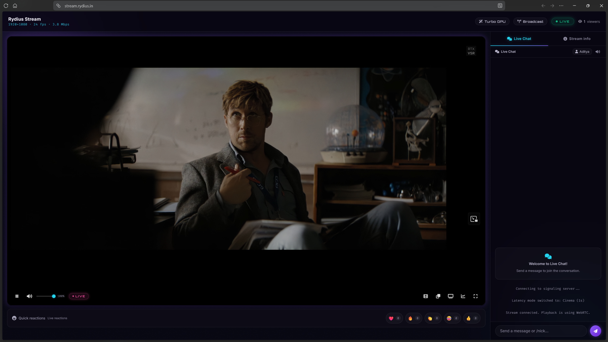

# Rydius Stream: laptop host



*A viewer watching a live stream at `https://stream.rydius.in` — WebRTC playback, the live-chat sidebar, quick reactions, and per-client stream stats.*

This setup runs OBS and MediaMTX on the same Windows laptop. The page and WebRTC signaling are served locally and published at **https://stream.rydius.in** through a Cloudflare Tunnel, so viewers just open a link — no Tailscale install, no account. Video for viewers that cannot reach the laptop directly relays through Cloudflare TURN. OBS video enters through loopback, so it does not use the hotspot upload until viewers connect. Tailscale Serve remains as a verified fallback.

## One-time setup

1. Run `setup_cloudflared.ps1` once in this folder. It authorizes `cloudflared` for the `rydius.in` zone (one browser step), creates the named tunnel `rydius-stream`, writes `cloudflared_config.yml`, points `stream.rydius.in` at the tunnel, and offers an **optional** Cloudflare TURN key (Dashboard → Realtime → TURN → *Create TURN key*; docs: https://developers.cloudflare.com/realtime/turn/generate-credentials/). TURN is metered (free 1,000 GB/month) and the dashboard may require a payment method — **skip it if you have no card**: remote viewing still works through the free STUN punch-through path, and the key can be added later by rerunning the script. If you add one, it + the API token land in `secrets.local.env`, which stays on this laptop — browsers only ever receive short-lived credentials minted by `server.js`.
2. Tailscale fallback (optional): install Tailscale on this laptop and each viewer device and sign in to the same tailnet. The first `tailscale serve --bg 3000` run may print a consent link that the tailnet admin must approve; confirm the private HTTPS hostname with `tailscale serve status`, then give viewers that URL with `/streaming/` appended.

`cloudflared_config.yml` and `secrets.local.env` are machine-local — do not share them. Rerunning `setup_cloudflared.ps1` is safe; it reuses the existing tunnel and DNS record.

## Start a stream

1. Double-click `start_host.bat` and leave its window open. It validates the MediaMTX config, starts MediaMTX, starts the Cloudflare tunnel (when configured), then starts the website and WebRTC signaling proxy.
2. In OBS, open **Settings → Stream**, select **Custom...**, set the server to `rtmp://127.0.0.1:1935/live`, and leave **Stream Key** empty.
3. Start OBS streaming. On the laptop, check `http://127.0.0.1:3000/streaming/`; remote viewers open `https://stream.rydius.in`. A tailnet viewer can also use the Tailscale URL.
4. Stop the host by pressing Ctrl+C in the launcher window. The launcher then stops the MediaMTX process it started.

Start with CBR and a 1-second keyframe interval (2s doubles each keyframe burst and doubles how long packet-loss recovery waits for the next IDR — both read as viewer stutter). Choose a bitrate below the hotspot's sustained upload rate and leave roughly 25% headroom. A hotspot may vary over time, so 4K/60 quality and latency depend on the measured upload and the viewer's connection.

### Always start the host from this folder, never from a git worktree

`server.js` serves its static assets from its own `__dirname`, and the launcher
starts MediaMTX with the `mediamtx.yml` sitting beside it. So **whichever folder
you launch from is the code every viewer gets.** A git worktree — the throwaway
sandbox an AI editor or agent creates — is a full second copy of this project, and
launching from one silently serves that copy while you edit this one.

The symptom is the confusing kind: a fix that "did nothing", or a `mediamtx.yml`
change that never takes effect, with nothing in the logs to say the running code
is not the code in this folder. This happened here in practice — the live site on
port 3000 was being served by a worktree whose `app.js` had already diverged from
this checkout's.

`start_host.ps1` now refuses to start when its own `.git` is a **file** rather
than a **directory**, which is what marks a linked worktree. The check is
structural rather than path-based, so it catches a worktree at any location and
never blocks the real project. If you see that refusal, you are in the wrong
folder: start the host from `C:\Users\adity\Videos\Streaming'`.

Two more consequences worth knowing:

- **Committed work is the only safe work.** Worktrees accumulated to 41 copies
  here, holding ~5 GB, and one of them carried 1,400 lines of *uncommitted*
  receiver fixes that existed nowhere else. Commit in a worktree before you clean
  up, or use `git worktree list` to see what you have.
- **Do not run `run_tests.py` from two places at once.** It deliberately holds a
  port open to prove the launcher retries a taken one, so a concurrent run makes
  both runs hang on each other.

## Codecs: H.264 + AV1 on the GPU (automatic renditions)

Every broadcast is served in **both codecs at once**, so no viewer is ever blocked by codec support and AV1-capable viewers use the least bandwidth:

- OBS publishes **either** NVENC H.264 **or** NVENC AV1 (both are hardware encoders on the RTX 4070). **For a mixed audience, broadcast H.264 via WHIP** — see the known limitation below. Use NVENC AV1 only when every viewer's browser decodes AV1.
- `codec_bridge.js` runs as a MediaMTX `runOnAvailable` hook on `live`. It reads the source over loopback RTSP (TCP transport — UDP loopback bursts can reorder packets) and publishes the complementary rendition with NVENC:
  - AV1 source → `live-h264` (`h264_nvenc`, default 6000k) so legacy browsers keep playing;
  - H.264 source → `live-av1` (`av1_nvenc`, default 3000k) so AV1 browsers save ~50% bandwidth per viewer.
- **Known limitation — fixed by the bundled ffmpeg:** an OBS **WHIP AV1** source cannot be bridged by **ffmpeg 8.0** (the system PATH version here). Its AV1 RTP depacketizer filters packets until it recognizes a keyframe via the aggregation header's N bit, and fragmented keyframes whose OBU size field is kept (libwebrtc does this) never reassemble — the reader loops forever on "AV1 RTP packet before keyframe / Unexpected fragment continuation" (CPU and NVDEC decode hang identically; the stall is upstream of decode). Fixed upstream by ffmpeg commit `d12791ef`, shipped in **8.1+**. The project therefore bundles **ffmpeg 8.1.3** in `ffmpeg_win/` and the bridge prefers it automatically (an explicit `BRIDGE_FFMPEG` still wins; the system PATH is the fallback) — verified: the bundled build bridges WHIP AV1 sources to a healthy `live-h264` in ~2.4s. As a safety net, a rendition that carries no video within 20s gets its transcoder killed and retried, and after repeated failures the bridge gives up with a clear console message. AV1-capable viewers are always unaffected (they play the native path); the player tells legacy viewers explicitly when a broadcast is AV1-only.
- The rendition pipeline is tuned for the receiver: NVENC runs `tune=ull` (ultra low latency: no lookahead) with ~**0.5-second** forced-IDR keyframes (`BRIDGE_GOP_SECONDS`, default 0.5) — the interval is a wall-clock target derived from the source's probed fps, and `-maxrate`/`-bufsize` cap the rate so joining viewers and packet-loss recovery lock on fast, the FLV muxer writes packets as they arrive (`-max_interleave_delta 0`, so a slow first keyframe can no longer stall the publish into MediaMTX's publisher timeout), and video decodes on NVDEC (`h264_cuvid`/`av1_cuvid`) when available so the CPU stays free for OBS capture. **Measured, not assumed:** halving the keyframe interval from 1s to 0.5s costs *nothing* in total bandwidth (9136 KB vs 9139 KB over 12s of 1080p60 at 6 Mbps — within 0.15%; the rate controller pays for the extra IDRs out of P-frame quality) and raises the 100ms peak by only ~8%, while the worst-case freeze after a lost keyframe halves. That matters more than usual here because **there is no PLI path from MediaMTX back to the bridge's ffmpeg over the RTMP publish leg** — the only recovery from a lost IDR is the next IDR already in the stream, so the keyframe interval *is* the entire recovery budget. Note also that `-maxrate`/`-bufsize` are **guidance to NVENC, not hard ceilings**: measured 1.08x of target over 1s windows on well-fed content, but 2-11x on pathological high-entropy input, because with lookahead disabled the only real ceiling is max-QP. Do not describe the peaks as bounded. A decoder that crash-loops twice is recorded in a temp state file for 24h — later broadcasts start directly on CPU decode — and a healthy 30s+ GPU run clears the record.
- The player picks the path per browser on every status poll: AV1 sources go native to AV1 browsers whose Media Capabilities probe says AV1 decodes smoothly (software decoders wait for `live-h264` like a legacy browser) and through `live-h264` for the rest. An H.264 source plays its **native path by default** on every browser — that path already carries the source codec at the source bitrate, and for an Opus source (the in-browser studio) it carries sound too. `live-av1` is a *degraded rung for a struggling link*, not a default: the ABR supervisor moves a viewer onto it after 8 sustained stressed seconds and back after 20 calm ones. It used to be the default for any AV1-capable browser, which silently cost every viewer the source quality — and cost a browser-published broadcast the most, because an H.264+Opus source gets no full-bitrate rescue rendition, so the 3000k rung was the only alternative any viewer could ever reach. (An H.264 source with **non**-Opus audio is different: MediaMTX cannot hand AAC to WebRTC readers at all, so the native path genuinely is muted and the audio-rescue rendition is correctly the default there.) While a required rendition is still spinning up (~2–4 s after OBS starts) the player shows *connecting* instead of a false offline, and if it never appears the viewer is told why.

Verified end to end on this machine (MediaMTX v1.21.1 + ffmpeg 8.0 + a real browser player): both bridge directions produce ~58 fps renditions read back over RTSP with zero timestamp errors, a 1920×1080 WHIP broadcast plays in the browser at 58–61 fps measured by the player HUD, the hook starts and stops with the source, `runOnUnavailable` kills any leftover ffmpeg (PID-file guard with a command-line match, so a recycled PID is never killed by mistake), and `/live/whep`, `/live-h264/whep` and `/live-av1/whep` all answer WHEP preflights. RTSP exists only for this bridge and is bound to `127.0.0.1:8554`; RTMP cannot serve AV1 out of MediaMTX, which is why the bridge reads via RTSP.

Tunables (optional environment variables, defaults match `mediamtx.yml`): `BRIDGE_H264_BITRATE` (6000k), `BRIDGE_AV1_BITRATE` (3000k), `BRIDGE_AUDIO_BITRATE` (160k), `BRIDGE_FFMPEG` (explicit override; defaults to the bundled `ffmpeg_win/` 8.1 build when present, else ffmpeg on PATH), `BRIDGE_GOP` (keyframes in frames — skips the frame-rate probe), `BRIDGE_FFPROBE` (ffprobe binary for the probe; defaults to the one next to the bundled ffmpeg).

When you raise the OBS bitrate, raise `BRIDGE_H264_BITRATE`/`BRIDGE_AV1_BITRATE` along with it: the renditions are fixed-rate, so AV1-capable viewers on an H.264 source keep receiving the `live-av1` rendition (default 3000k) no matter how high the source bitrate goes — otherwise the extra source quality never reaches them. **This default is worth raising.** Measured against a 12 Mbps H.264 1080p60 source: the AV1 rendition at 3000k scores SSIM 0.955 / PSNR 32.8 dB, at 5000k 0.965 / 34.1 dB, and at 6600k (55% of source) 0.971 — while AV1 at 3000k still beats H.264 at 3000k by +3.9 dB *and* is 7% smaller, so AV1 buys roughly 45% efficiency here. That means modern AV1 viewers are receiving roughly **half** the effective quality of legacy H.264 viewers, which is backwards: they have the newer hardware. A live OBS profile running 1080p30 at 25 Mbps into a 3000k AV1 rendition is an 8.3x downshift; AV1 does not buy 8x. Latency is not a constraint for this project, so there is no reason to keep the rendition starved.

`live-av1` is now reached by the ABR supervisor rather than by default, so its bitrate only matters for viewers the network actually forced down to it — a weak hotspot, not a healthy LAN. It is still worth raising `BRIDGE_AV1_BITRATE` for that case: measured against a 12 Mbps H.264 1080p60 source, the AV1 rendition scores SSIM 0.955 / PSNR 32.8 dB at 3000k, 0.965 / 34.1 dB at 5000k and 0.971 at 6600k. Nobody on a healthy link is downshifting any more, so a low `BRIDGE_AV1_BITRATE` now costs quality only to viewers who have already lost packets.


**Audio:** RTMP and SRT carry AAC, which MediaMTX cannot convert for WebRTC readers — but the bridge now rescues it. Whenever the source audio is not Opus, `codec_bridge.js` emits a **second output** from the same ffmpeg process (H264 sources: a `-c:v copy` rendition at zero extra GPU cost; AV1 sources: an NVENC AV1 encode) with the audio re-encoded to Opus, and the player routes **every** viewer of such a broadcast to that full-quality, full-sound rendition instead of the muted native path (`live`). WHIP remains the best ingest (Opus natively, so the native path already carries sound and AV1 browsers keep the bandwidth-saving `live-av1` rendition), but an RTMP broadcast is no longer silent: viewers get video **and** audio with no OBS settings change. The bridge also re-reads the source track list after every ffmpeg restart, so an OBS auto-reconnect with a *different* encoder (H.264 ↔ AV1) re-plans the renditions instead of crash-looping on the stale plan.

## Connection notes

Two Cloudflare pieces do different jobs, and neither requires a credit card for the primary path:

- **Cloudflare STUN (free, no account, no card)** — both MediaMTX and the player receive `stun.cloudflare.com:3478` from the config and `/stream-api/turn`, so each side learns its public address and hole-punches a direct UDP path. Verified from this hotspot with a real binding request (a public mapped address came back). This is how remote viewers connect without any paid Cloudflare product.
- **Cloudflare Tunnel** (free) carries the HTTPS page and WebRTC/WHEP signaling from `stream.rydius.in` to `server.js`. It dials outward only, so it works behind the hotspot's CGNAT without port forwarding — but it does not carry video UDP.
- **Cloudflare TURN** (optional — metered, may require a payment method even for the free 1,000 GB/month) is the relay fallback for a viewer whose network refuses hole punching. `server.js` mints short-lived credentials at `/stream-api/turn` (the API token stays server-side) and appends them only when configured; Google STUN and browser-blocked port-53 URLs are stripped everywhere. If TURN is unavailable, a viewer behind a strict NAT may not connect — that is what the Tailscale fallback is for.

MediaMTX configures Cloudflare STUN only — Google STUN was historically unreliable from this network and stays out. Hole punching is the primary remote path; TURN relay (when configured) is the fallback, and Tailscale covers the rare viewer behind a strict NAT.

With the Tailscale fallback, WebRTC media travels over the tailnet; `tailscale ping <laptop-name>` from a viewer device shows whether the path is direct or relayed. **ICE-TCP is deliberately off** (`webrtcLocalTCPAddress: ""`, MediaMTX's own default, and its shipped reference says why: *"TCP is less efficient than UDP and introduces a progressive delay when network is congested"*). This project's media is DTLS-SRTP, so a negotiated TCP candidate inherits head-of-line blocking — one lost segment stalls all subsequent video until RTO expiry, turning a ~20 ms UDP jitter blip on a lossy hotspot into a 200–600 ms hard freeze. Muxing it on the same port as UDP also lets a viewer whose network throttles UDP win nomination onto that worse path with nothing in the UI to say so. Tailscale carries the tailnet over UDP itself (with DERP as *its* fallback), so a tailnet that can reach the laptop can almost always reach 8189 over UDP. If a viewer genuinely cannot do UDP, give them TURN (`secrets.local.env` → `/stream-api/turn`) instead — TURN/UDP is not head-of-line blocked. If ICE-TCP is ever re-enabled, put it on a **separate** port, never multiplexed onto 8189.

SRT and WHIP ingest entries in the page are optional alternatives for OBS running on this laptop. The standard setup is RTMP to loopback. The MediaMTX config and binary are kept in the project so the host can start without a VPS.

## Local checks

Run `python run_tests.py` from this folder (Node.js must be on PATH). The suite covers:

- **Page integrity** — unique element IDs, every `querySelector` target in `app.js` exists in `index.html`, every `/streaming/...` asset is in the `server.js` allowlist and shares one cache version.
- **Cross-file consistency** — RTMP, SRT, WHIP, RTSP and control-API ports must agree between `mediamtx.yml`, `index.html`, `server.js` and `start_host.ps1`.
- **Codec bridge** — `codec_bridge.js` must be present and parseable, its default ports must match `mediamtx.yml` (RTSP/RTMP/API), the config must bind RTSP to loopback and declare both rendition paths with the `runOnAvailable`/`runOnUnavailable` hooks, and the bridge direction matrix must map AV1→`live-h264` / H.264→`live-av1` with GPU encoders, Opus-preserving audio and B-frames off.
- **The `/stream-api` proxy** — request forwarding (path, query, body, Host), `Location` rewriting for same-origin redirects only, CORS exposure of `Location`, `/stream-api/v3/**` routed to the control API port, 404 pass-through, `no-store` on proxied answers, and 502 with a clear message when MediaMTX is down.
- **TURN credential proxy** — `/stream-api/turn` always serves the free Cloudflare STUN entry even without Cloudflare configuration, mints through a stubbed Cloudflare API using the server-side `Authorization` header when configured, strips Google STUN and browser-blocked port-53 URLs, caches one mint for the whole room, backs off after failures, and never exposes the token to a browser.
- **Static server hardening** — HEAD without a body, 405 with `Allow: GET, HEAD`, host source files never served, invalid `PORT`/`MEDIAMTX_*_PORT` rejected at boot.
- **Browser logic** (`js_checks.js`) — runs the real `app.js` functions in Node: SDP tuning (bandwidth ceiling, `rtcp-fb` lines scoped to the video section, idempotence), status polling and reconnect backoff, disconnect cleanup, the latency-mode table (plus persistence of a manual choice), windowed playout-delay measurement (the drift-detection ground truth — cumulative `jitterBufferDelay` averages hide fresh drift within seconds), AV1 capability detection, and the rendition path matrix (`live` / `live-av1` / `live-h264` selection per browser codec support).
- **MediaMTX contract** — boots the bundled MediaMTX on free ports and checks `GET /v3/paths/list` reports the `live` path state, `OPTIONS /live/whep` answers 204 with no publisher (which is why the player never probes liveness with OPTIONS), and WHEP session creation fails fast without one.
- **Receiver-lag fixes** — the player fetches Cloudflare-STUN-plus-optional-TURN ICE config, the WHEP POST is time-bounded, the adaptive buffer supervisor stays wired into the stats loop (and sleeps while the tab is hidden, where Chrome suspends presentation and delay measurements are meaningless), sustained frame drops auto-enable Eco Mode, MediaMTX queue/UDP buffers stay tuned (per-reader queue 2048: an empty queue costs nothing on a healthy link, and on a hotspot hiccup the backlog survives instead of overflowing into lost packets that break decode), the HUD shows the measured live playout delay next to the buffer target, a manual latency choice persists across visits, a returning background tab resumes telemetry without zeroing its measurement baselines, the playout target grows with measured network jitter (a fixed target on a jitterful link turns late frames into visible drops), buffer accommodation is **drop-gated** — the target rises only while frames are actually being discarded late (measured by `framesDropped` *or* by frames that arrived but never left the jitter buffer, an independent signal the measured mean cannot hide) and the buffer has outgrown the base target, holds while Chrome sits at it (a controller that raised to meet the measured delay would chase its own tail and inflate every session to the cap), and drains 50ms per tick after sustained calm — a delay still outgrowing the cap means the session itself is stale and triggers a clean rejoin at the live edge (bounded by the switch cooldown), returning from a hidden tab measures the hidden span immediately with one fresh stats delta and feeds it to the supervisor (a hidden span inflates the buffer to seconds — but the decision to rejoin needs **three** consecutive over-cap readings, because a normal Alt-Tab measures 1.7-2.8s against a 3.1s trip point, and the in-loop path already required persistence), an ABR loop switches stressed viewers onto the low-bitrate rendition and back after 20 calm seconds (and **only** when the browser can actually decode AV1 — a legacy browser keeps its decodable full-bitrate path, since an undecodable session is strictly worse than the stutter it is escaping), the SDP offer advertises NACK/PLI/transport-cc feedback for **every** video payload type (not just H.264) so AV1/VP9 streams can retransmit lost packets and request fresh keyframes, frame drops are measured through a rolling window (GOP-periodic bursts) and against actually-rendered frames (rVFC), the viewer ICE cache respects the mint half-life, and the codec bridge runs the verified low-latency pipeline (TCP RTSP read, NVDEC decode with automatic fallback, `tune=ull`, forced IDR keyframes, rendition watchdog).
- **Host & community hardening** — the site server installs process-level resilience handlers (a stray rejected promise logs instead of killing the host mid-broadcast; startup config errors still fail fast before the handlers arm), emoji reactions are rate-limited per IP (10 per 2s, swept like chat), the live viewer count is broadcast over SSE on every join and leave and rendered in the header, and a decode-pressure loop moves a viewer whose decoder falls behind onto the hardware-decodable rendition (native AV1 → `live-h264`, the AV1 rendition of an H.264 source → native H.264).
- **Connected-but-black limbo recovery** — a session where the WHEP handshake and ICE both succeed yet no frame ever decodes (the publisher vanished between the status probe and the handshake, or the offered codec cannot decode on this device) used to hang on a black picture forever: the freeze watchdog needs bytes flowing AND at least one decoded frame, so it can never fire there. The stats loop now detects the limbo (zero decoded frames 10s after connecting) and rejoins at the live edge, capped at three attempts with a clear "broadcast may be incompatible" notice afterwards. The staged freeze recovery is bounded too — `player.play()` stays pending forever on a media-less session, so each stage's await is time-boxed and stage 2 (decoder flush) must prove it restored playback before it can skip the stage-3 full session renewal. H.265 WHIP sources are routed by real receive capability: a browser without H265 support rides the bridge's AV1 rendition instead of a native path MediaMTX would happily answer with a stream it cannot decode.
- **Connection & recovery hardening** — a `navigator.connection` interface-type change (wifi → hotspot, band switch) tears down and rejoins immediately instead of waiting for ICE failure detection; the browser's own `online` event tears down a session still sitting in ICE `disconnected` (its path belongs to a network that no longer exists, so the 2.5s self-heal grace cannot help); the ICE config is prefetched in parallel with the first status poll and the in-flight fetch is memoized so a connect never double-fetches; `RTCPeerConnection` uses a small `iceCandidatePoolSize` so reconnects gather candidates sooner; STUN/TURN failures are surfaced through `onicecandidateerror` (once per connection, also in the diagnostic export) — a network that blocks UDP STUN used to loop connecting→offline with no explanation; the volume slider no longer attenuates twice (the WebAudio graph taps the element *after* its volume property, so the old code played 50% at 25% — the multiplier now rides exactly one control); the HUD gains a **Route** row (direct hole-punch vs TURN relay — the first thing to check for a stuttering remote viewer) and the diagnostic export includes the route plus NACK/PLI recovery counters; the header shows the **live viewer count** broadcast by the server over SSE on every page join/leave; chat SSE events carry `id:` lines so an EventSource auto-reconnect replays exactly the missed messages through the server's existing Last-Event-ID support; chat dedupe sets are capped so marathon sessions cannot leak memory; ABR can step a struggling viewer down to the light rendition from the audio-rescue path too, and upgrades back to whatever the path matrix prefers (the full-sound rendition for RTMP broadcasts, not a muted native path).
- **Server hardening** — the MediaMTX proxy rides a keep-alive connection pool (warm sockets for every viewer's status probe and WHEP handshake instead of a fresh TCP connect per request), a second launcher hitting an occupied port fails with a readable message instead of an `EADDRINUSE` stack trace, the SSE broadcast applies backpressure protection (a dead tab that stops reading is destroyed instead of buffering unbounded memory), and the chat rate-limit map is swept of expired entries; every response carries an error listener so a socket write racing a disconnect can never escalate beyond the connection, static reads that fail mid-flight (Windows editor save replacing the file) cut the connection instead of crashing, and page assets are served **gzip-compressed** when the browser asks (`Accept-Encoding`) — app.js drops ~170 KB → ~40 KB, roughly 4x faster first load on the LAN/Tailscale paths (the Cloudflare tunnel already compresses), with 304 revalidation untouched.
- **Bridge stall watchdog** — the rendition watchdog now has two phases: the verified startup phase (no video within 20s → restart) plus a **mid-broadcast stall** phase driven by the control API's per-path byte counter: once video has flowed, two consecutive samples that show no new bytes reaching the published path (a hung NVENC session, a dead RTSP leg that never errors) kill and rebuild the transcoder, because MediaMTX keeps the path online either way and rendition viewers would freeze indefinitely. The signal is deliberately **not** ffmpeg's stderr: ffmpeg prints its `frame=` progress line at `AV_LOG_INFO` and the bridge runs at `-loglevel warning`, so a stderr-gated watchdog could never fire at all (measured: 0 matching lines at `warning`, present at `info`). Published bytes are also the stronger evidence — they prove output is reaching the path, not merely that a process is alive. **It must be `bytesReceived`, not `bytesSent`.** In MediaMTX v1.21.1 `bytesReceived` is `InboundBytes` (from the publisher) while `bytesSent` is `OutboundBytes` — bytes delivered to **readers**. The bridge never subscribes to its own renditions, so on a healthy source with zero viewers `bytesSent` sits at exactly 0 forever: using it inverted the watchdog into firing every ~38 s and rebuilding the transcoder, taking both rendition paths non-joinable for 4.2 s per cycle (11% of wall-clock time, forever) — and with a single viewer attached it never fired at all, so the bug was invisible exactly when somebody was testing it. Measured on a scratch MediaMTX: with 0 readers `bytesReceived` climbed 3.5 MB → 9.0 MB over 8 s while `bytesSent` stayed 0; attaching one reader made `bytesSent` advance at the full source rate.
- **Bridge resilience** — the ffmpeg failure budget is genuinely *consecutive*: a run of 30s or more clears the strike count, so ten unrelated ffmpeg exits spread over a long broadcast (one per OBS auto-reconnect, one per host stall) can no longer accumulate into a permanent `exit(1)` that kills the rendition for the rest of the broadcast. `runOnAvailableRestart: true` means a bridge that does exit is re-run. The Opus rescue re-encodes with `aresample=async=1` so a source audio clock running slightly fast cannot walk the audio timestamps progressively ahead of video and leave the browser nudging `playbackRate` forever.

## Viewer-smoothness audit

A dedicated pass looked only for things that make a viewer's picture not smooth, at every layer. Findings and fixes:

**Transport / sender**
- `udpMaxPayloadSize` is set to 1200 rather than the 1452 default. An earlier audit round claimed the default was fragmenting every packet to remote viewers (this host's Tailscale adapter reports an MTU of 1280). **That claim was measured and is false**, and both the `mediamtx.yml` comment and the regression test now record the correction: against a real 1280x720 publish read by real headless Chrome through a real WHEP session, the mean inbound video RTP packet size was 901.1–902.1 bytes at *200*, *1200* and *1452* alike — the WebRTC path does not read this key at all, it packetizes with its own ~1200-byte MTU, which fits a 1280-byte MTU comfortably. 1200 is kept because the key is honoured by MediaMTX's other RTP consumers, but it was never a fragmentation fix and there was never WebRTC fragmentation on this host.
- The launcher reused a running MediaMTX instance **without comparing its config**, so editing any tuning knob and re-running was a silent no-op — the "tuned setting that does nothing" failure mode. It now diffs the running instance's effective config against `mediamtx.yml` and refuses to start if they differ.

**Compositing (the always-on costs)**
- `.video-container` ran an infinite `border-breathe` animation on `border-color` — a paint property on the element that *is* the video, i.e. a full-video-sized repaint every frame for the whole session — plus `will-change: transform`, which is the documented way to pull a `<video>` off the hardware-overlay path. Both removed.
- Three blurred ambient orbs animated behind three `backdrop-filter` surfaces, so ~500k pixels of Gaussian blur re-ran on every decoded frame. The orbs are now static, which lets the compositor cache the blur.
- The unmute button carried a `backdrop-filter` sitting directly on top of live video, and autoplay is only permitted muted — so it was there for the entire session by default. The idle action-ripple and volume-toast overlays used `opacity: 0` only, which still keeps a render surface alive; they now use `visibility: hidden`.

**Player control loop**
- The stress-raise was a **wall-clock stamp** expiring after 15s. Simulated end to end against the extracted real functions, a continuously marginal link produced a perfect square wave — 350ms for 15s, 180ms for 7s, five target steps per minute, forever — on a link that never once went calm. Every step re-paces the browser's playout. It is now a level that is *held* while the link is stressed.
- The anti-stutter accommodation was gated on a mean computed over the frames that **left** the jitter buffer, so late-discarded frames were excluded from numerator and denominator alike. On a slow link discarding 13 frames in 60s the mean peaked at 153ms against a 330ms requirement and the target never moved once — the mechanism was blind to the exact condition it exists to catch. It now also uses an independent late-frame signal (`framesReceived` vs `jitterBufferEmittedCount`).
- The drift rejoin counted **ticks**, not measurements. Three ticks containing zero new readings satisfied the confirmation and forced a 2–4s hard teardown of a healthy session, because the reading latches through a quiet window. It now requires a fresh reading.
- Every `jitterBufferTarget` write re-paces the browser's playout, and the floor used to decay 25ms *every tick* — 24 consecutive writes after one jitter spike. Writes are now band-limited and dwell-limited, with a faster path for a raise while frames are genuinely being dropped.
- The playout target was pushed to the **audio** receiver at video scale. Per spec, synchronized tracks use the larger of the two targets for *both*, so a 2200ms video target on the audio receiver stretches audio instead of containing itself.
- Returning from a hidden tab reconnected on a **single** reading, while the periodic supervisor required three. A normal Alt-Tab measures 1.7–2.8s against a 3.1s trip point, so this could end in a hard freeze. It now requires persistence, like the loop.
- `degradationPreference` is pinned to `maintain-resolution`: the default lets Chrome trade resolution away silently, and on a live stream the picture just gets softer with nothing "lost", so no controller can see it.
- The freeze watchdog used to run its own `getStats()` on top of the stats loop's — 1.67 full graph walks per second on the low-end receivers this code protects. It now reads the loop's snapshot and rejects a stale one.
- The HUD level meter wrote `style.width` every animation frame and kept re-arming while muted. It is now sampled at ~12Hz, writes only on change, and stops when there is nothing to measure.
- Auto-Eco was permanently disabled by *any* prior toggle click, including one that left it on the expensive "Turbo GPU" setting. Only an explicit Eco choice now vetoes the relief.

**Signaling**
- `server.keepAliveTimeout` was Node's 5s default while the client polls every 5s, so pooled sockets were torn down in a race with the next request; a WHEP handshake is a POST, which browsers do not reliably retry on a reused socket. Now 65s.
- The SSE "backpressure guard" counted consecutive `write()===false` returns, which cannot happen until the kernel socket buffer is already full — measured at 6000 events (~1.2MB) producing zero false returns. It now counts bytes and marks a subscriber lagging, recoverable on `drain`.
- `x-forwarded-for` was used as a rate-limit key even when nothing rewrites it, so the per-IP reaction limit was bypassable with one header per request. Forwarded headers are now trusted only behind the tunnel.
- The 304 branch omitted `Vary: Accept-Encoding` that the 200 sets.
- Reaction rate is now capped **globally** as well as per IP, and concurrent floating emoji over the video are capped — the aggregate is per-viewer rate × viewer count, and each one is a composited layer on top of the picture.
- The chat log's autoscroll read `scrollHeight` immediately after `appendChild`, which is a forced synchronous layout — one full sidebar relayout per message, on the same thread that decodes video. It is now deferred to the next animation frame so a burst coalesces into one layout.
- Webfonts use `display=optional`. The Google Fonts sheet is cross-origin and therefore render-blocking, so with the default `swap` the fonts arrive *after* the handshake has started playback and the swap re-metrics every header/chat/HUD string — a full relayout in the first seconds of a live stream.
- The cursor-hide helper wrote the **root** element's inline style on every qualifying mousemove, while writing the same value it had already written (outside fullscreen `hide` is always false). It now skips the no-op write.

## Fourth-pass audit — the seam was dead code, and drift cost a black screen

The third pass fixed a rendition switch that blacked out for 2–4 s. That fix regressed on the very next change, in a way the existing tests could not see, and the result was worse than the bug it replaced.

### Every rendition switch ended in a permanent black screen
`switchRendition` armed the seam and *then* called `cleanupConnection(true)`:

```js
switchSeamPending = true;
cleanupConnection(true);      // <- and this sets switchSeamPending = false
```

`cleanupConnection` **owns** the seam's lifetime — it cancels the 12 s safety net and clears the flag on every teardown path, and it must, because Stage 2 and every graceful ICE teardown run through it. So that call destroyed the flag one statement after it was set, and `if (switchSeamPending && …)` in `ontrack` was **provably unreachable on every switch**. The comment beside the code claimed the flag "stays TRUE here"; the code said otherwise. The teardown now runs first and the seam is armed after it.

The consequence cascaded. The 12 s net's only success-path cancel lived *inside* that unreachable branch, so **the net fired on every switch, including perfectly healthy ones**, and when it fired it could not recover:

```js
if (player.srcObject) { player.pause(); player.srcObject = null; }
cleanupConnection();
connectStream();              // <- returns immediately
```

`cleanupConnection` only releases resources; it never touches `isConnected`/`isConnecting`, and `handleConnected()` had set `isConnected = true` for the replacement session. So `connectStream()` hit its own duplicate guard and did nothing. The page was left with `player.srcObject === null`, `peerConnection === null`, `isConnected === true` — and **every** recovery path is gated off by exactly that combination: the freeze watchdog needs a peer connection *and* an unpaused element, the stats loop needs a connected peer connection, rVFC needs frames, and the status poll skips while `isConnected`. A black screen only a manual reload could clear. The net now clears the flags before reconnecting, so it is a recovery rather than a self-wound-down session.

Separately, that cancel sat *inside* the `if (keepPicture)` early-return, so a **full** teardown (Stage 3, `handleDisconnected`) left the orphan armed: the page painted offline and then, 12 s later, reconnected itself — offline → connecting → live, by itself. Both statements moved above the branch, because the net belongs to the *session*, not to the `keepPicture` choice.

The test that was supposed to catch this could not: it scanned the text between `switchSeamPending = true;` and the first `await` for a clearing statement, and the clearing statement lives in a *different function*. Only the **order of the two calls** proves anything, so that is what is now asserted.

### Drift was answered with a full session teardown
The latency-mode table's own comment described "the stepwise catch-up drains it back at 150 ms/s". **That code did not exist** — `playbackRate` appeared nowhere in `app.js`. Drift had exactly one response: tear the WHEP session down and rebuild it. That is a 2–4 s hard black screen plus a full ICE + WHEP renegotiation to recover what is purely accumulated latency, and the dominant source of that latency is an ordinary Alt-Tab, which this project's own measurements put at **1.7–2.8 s**.

Every production low-latency player (Twitch, YouTube Live, Meet) instead speeds the media element up so the jitter buffer drains itself, then returns to 1.0×. That is now implemented, and it changes the common case completely:

- `catchUpPlaybackRate()` ramps `playbackRate` toward **1.08×**, 1 % per stats tick in either direction. A step change is audible as a click and a raw per-tick formula would step on every noisy reading; the ramp avoids both. At 1.08× the drain is ~80 ms/s, so **1.5 s of drift is gone in 26 s with no black frame and no renegotiation** (measured in `js_checks.js catchup-rate-drains-without-a-teardown`).
- The gain has a deliberate **5 % floor**. A pure proportional law tends to zero as the delay approaches the dead band: simulated against the real function, a floorless curve sat at 1.01× from 330 ms down to 180 ms — 20 ms/s, a 15-second crawl to close 150 ms, and *formally never converging*, because each tick's excess is smaller than the last. The floor is what makes it terminate.
- The hard rejoin is **kept**, as the escalation for when the drain genuinely cannot keep up, so the safety net is unchanged — it is just no longer the first thing that happens.
- The controller **proves it works before trusting it**. If the delay has not fallen 5 s after catch-up engaged — an engine that accepts the write and ignores it, or a link too congested for 8 % to matter — it disables itself permanently for the session rather than leaving the viewer watching a permanently fast stream while the real problem goes untreated.
- `playbackRate` is a property of the **media element**, not of the peer connection, so it survives every teardown in the file. It is reset when a new session starts and when the tab is backgrounded (where presentation is suspended and there is nothing to drain).

## Second-pass audit — bugs the first pass introduced, and more

A second, deeper pass ran four parallel audits over areas the first one never touched (SDP/ICE handshake, audio, long-session stability, bridge ingest) and re-verified everything the first pass shipped. It found four regressions **in the first pass's own fixes**, all now fixed and all pinned by tests:

- **`first_pts=0` destroyed A/V sync.** The first pass added `-af aresample=async=1:first_pts=0` to the Opus rescue, believing it tidied the timeline. It does the opposite: `first_pts` forces the resampler's output to begin at PTS 0, which drags the audio track onto the video track's head. Measured with the bundled ffmpeg on a source whose audio starts 279 ms after its video — an ordinary OBS audio-device offset — the shipped filter turned +279 ms into **−7 ms** (destroyed, sign flipped), while plain `async=1` preserved it at **+294 ms**. Every rendition was shipping a permanent lip-sync error, which viewers report as the video being "janky" when it is purely an audio offset.
- **The SSE backpressure guard destroyed every subscriber.** It accumulated bytes written and only reset on `drain`, which fires solely after a `write()` has returned false. A *healthy* reader never drains, never resets, and climbs forever: real payload 173 bytes, so `ceil(262144/173) = 1516` events — about 1.2 h of a busy chat — after which every viewer was disconnected at once and each auto-reconnected. Verified twice: the real payload arithmetic, and a live socket probe that pushed 20,000 events past a healthy reader with zero disconnects. The guard now reads `writableLength`, the stream's own queue depth.
- **The rendition stall watchdog rebuilt a healthy transcoder forever.** It judged liveness from MediaMTX's `bytesSent`, which is **egress to readers**, not ingest — so with nobody watching it sits at exactly 0. Measured on a scratch MediaMTX: with zero readers `bytesReceived` climbed 3.5 MB → 9.0 MB over 8 s while `bytesSent` stayed 0; attaching one reader made `bytesSent` advance at the full source rate. The watchdog therefore fired every 38.2 s, taking both rendition paths not-joinable for 4.24 s per cycle (11.1 % of wall-clock time) and never firing at all when a viewer *was* watching. It now uses `bytesReceived`, and treats a counter *decrease* (a new publisher connected) as activity rather than a stall.
- **An aborted WHEP POST could wedge the page forever.** A first-pass fix cleared `isConnecting` in the `AbortError` branch. The 16 s connect watchdog is gated on `isConnecting && !isConnected`, and only `handleDisconnected()` re-arms the status poll — so clearing the flag alone left a hung attempt with no watchdog, no teardown (PeerConnection still open, no WHEP `DELETE` ever sent) and no retry. Measured: still on "connecting" after 60 s with 1 POST, 0 DELETEs, zero pending timers. The branch now runs the real teardown.

Also fixed from the second pass:

- **The connect watchdog never covered ICE.** It was armed before signaling and cleared only on connect, so it had to cover 2.5 s ICE fetch + 3 s gather + up to 10 s WHEP POST = 15.5 s of a 15 s budget, leaving half a second for the actual connection. A remote or relayed viewer — exactly the audience the tunnel serves — that would connect at 16 s was torn down at 15 s, and every retry repeated it. LAN viewers connect in ~50 ms and never saw it. The watchdog is now re-armed after the answer to cover ICE alone.
- **The offer could be sent with no usable candidate.** The gather window was a fixed 3 s deadline. This page never calls `getUserMedia`, so Chrome mDNS-obfuscates its host candidates as `*.local`, and MediaMTX (Pion) resolves no mDNS — an offer carrying only those has nothing to connect to. A fixed deadline POSTed exactly that on the networks the code itself diagnoses as blocking UDP STUN, and cut off any `turns:` relay needing more than 3 s to allocate. It now waits for a *routable* candidate (6 s cap, 400 ms settle so follow-up candidates still ride along).
- **The `rtcp-fb` collection pass swept the whole SDP** while the injection pass was section-scoped, so a payload type also present in `m=audio` counted as "already has feedback" and the video section silently kept only what audio declared. Reproduced with a colliding fixture: video came out with `nack pli` and `goog-remb` but **no `nack`** — no retransmission at all. Chrome's payload ranges don't collide today, so this was a latent trap; both passes are now scoped identically.
- **The adaptive buffer walked itself to its cap while paused.** With the new late-frame signal (`framesReceived` vs `jitterBufferEmittedCount`), a paused viewer satisfies it *permanently* — packets keep arriving, nothing leaves the jitter buffer — so the target ratcheted to 2200 ms in 50 ms steps, ~44 writes each re-pacing playout, and resumed into a long slow-motion catch-up. The supervisor now bails on `player.paused`, as the freeze watchdog and audio meter already did.
- **`onicecandidateerror` was missing from the teardown list**, so a candidate error from a gathering pass still in flight posted a chat warning after the offline banner for a session that no longer existed.
- A suspended `AudioContext` after `createMediaElementSource` is wired left **permanent silence** — the gesture listeners that would rescue it had already removed themselves. There is now an `onstatechange` recovery. (A suspended context does *not* stall the video: the media element has its own clock, which is why this was invisible in the video path.)
- `playSfx` created an `OscillatorNode`/`GainNode` pair per call and disconnected neither — 400 nodes from 200 calls, each a connected subgraph anchored on the destination. It now disconnects on `end` and caps concurrent voices at 6.
- A WebAudio `resume()` on the ordinary autoplay path had no `.catch()`, so it rejected unhandled for every viewer who connected without clicking.
- The wheel handler wrote `player.volume` immediately before `setMasterGain`, which sets it straight back — two `volumechange` events per notch, each fanning out to overlay style writes.

### Corrections to earlier claims

- **The IP-fragmentation claim was wrong and is retracted.** The first pass asserted MediaMTX's 1452-byte `udpMaxPayloadSize` default was fragmenting every packet to remote viewers because this host's Tailscale adapter reports an MTU of 1280. Measured A/B with a real 1280×720 publish read by real headless Chrome through a real WHEP session: the mean inbound video RTP packet size was **901.1–902.1 bytes at 200, at 1200 and at 1452 alike**. The WebRTC path does not read that key at all — it packetizes with its own ~1200-byte MTU, which fits 1280 comfortably. There was never fragmentation on the WebRTC path. The value stays at 1200 because the key is honoured by MediaMTX's other RTP consumers, but the config comment and the regression test now record the correction.
- **The rendition GOP measurement is stale.** The bridge now derives its keyframe interval from a probed frame rate (`gopSeconds()`), so the old "exactly 1.000 s, verified with `trace_headers`" no longer describes the shipped default.

Run a single check with `python run_tests.py JsLogicChecks.test_sdp_advertises_exactly_one_video_bandwidth_ceiling`; `node js_checks.js --list` prints the browser-logic cases.

## Third-pass audit — controller bugs, compositing, and the transport budget

Six disjoint audits (playback core, stats/watchdog, session lifecycle, bridge, rendering, transport) plus direct measurement with the bundled ffmpeg and against the live MediaMTX. The theme of this round: **guards that were supposed to bound a controller were not bounding it**, in both directions — they either never fired, or fired unconditionally.

### The buffer accommodation climbed to its cap on any real link
`bufferAccommodationMs()` compared the measured delay against `baseBufferTargetMs()`, which *deliberately excludes* `accommodationTargetMs`. So once Chrome converged on a granted target, `delay > base + 150` stayed permanently true and every drop-tick re-granted `delay + 100`: simulated against the real function, 180 ms → 2200 ms in 19 ticks, ~11 of which cleared the band/dwell gates and became real `jitterBufferTarget` writes — **~1.1 s of frozen picture in the first 20 s of any rough session**, since a write above the filled level makes Chrome *hold* frames. The drop-gate that was supposed to prevent exactly this only ever stopped the climb for the no-drops case. The raise now references the level **already granted**, never the bare base, and can never return less than it held (it used to collapse 2200 → 500 in one tick). A genuinely larger measured need still raises. Pinned by `js_checks.js buffer-accommodation-gate`.

### The stress raise was released as one 170 ms step
`adaptiveRaiseLevelMs` went 350 → 0 in a single tick, and a *downward* `jitterBufferTarget` is precisely what makes Chrome **discard** frames to reach the new level — 170 ms of frames, 5 dropped at 30 fps, on every stress→calm transition. It was the largest move in the system and the only one with no ramp, while the jitter floor decayed in 25 ms steps and the accommodation in 50 ms. It now releases in 50 ms steps, each with its own calm window.

### The dead band reset both accumulators, so marginal links got no protection at all
`stressRunSec` needs 3 consecutive stressed ticks and `abrBadSec` needs 8, but the ambiguous band (jitter 25–55 ms, **or loss 0.8–2.5 %**) zeroed *both*. A link stressed 2 ticks in 3 could therefore never cross either threshold — and the jitter floor, the only other absorber, is driven by jitter alone, so a lossy-but-not-jittery link (3 % loss, 20 ms jitter — ordinary congested Wi-Fi) reports *low* jitter and got no buffer at all. The band now **holds** rather than resets; each branch still zeroes the other counter on a genuine transition, and the two are mutually exclusive, so nothing leaks. Same fix applied to the ABR pair.

### Transport loss was being charged to the decoder
`framesDiscarded` was read **nowhere in the repository**. The decode-pressure ratio used `framesReceived`, which counts every frame handed to the jitter buffer *including* ones the decoder then dropped — so a lossy link, a problem the buffers already absorb, looked exactly like a struggling decoder and fired a full session teardown (2–4 s black) with the message *"this device's decoder can't keep up"*. The ratio is now `(decoded + discarded) / received`. The old `[0.70, 0.90)` dead band also meant a decoder stuck at 83 % of arrivals — a permanently stuttering picture, the exact case the hardware-path switch exists for — never accumulated at all; the band is now `[0.85, 0.98)`. Pinned by `js_checks.js decode-lag-state-machine`.

### Two guards that were dead code
- The tab-return re-baseline flag was consumed ~100 lines before its second read, so the hidden-span guard **never ran** — the exact damage its own comment describes. Captured once and used for both reads.
- `noMediaRejoinCount` was reset by the very function every rejoin re-entered, so it could never exceed 1: the cap of 3 and the "broadcast may be incompatible" notice were **unreachable**, and a permanently black broadcast looped a full teardown + reconnect + a chat message every ~11 s, forever. The budget is now per-*broadcast* (restored by the `decoded > 0` branch), not per-session.

### `connectStream` had no generation token
The function read the module-global `peerConnection` after every await, including a 3 s ICE-gather window that teardown could not cancel. A torn-down attempt therefore kept running and then operated on the **next** attempt's connection: reproduced with the real extracted function, a stale continuation woke at 3.0 s and tore down a *healthy* 1.9 s-old peer connection, and a second WHEP POST went out carrying the new pc's SDP — two MediaMTX reader sessions for one viewer, with `whepSessionUrl` overwritten so the orphan could never be `DELETE`d. The pc is now bound locally with an identity check after every await, the gather timer is module-scoped and cancelled on teardown, and a superseded answer releases the reader it just created.

### Every rendition switch was a guaranteed 2–4 s black screen
`switchRendition` is the single choke point for *all* path changes (ABR steps, the limbo rejoin, the drift rejoin, the decode-pressure hop), and teardown nulled `player.srcObject` before the replacement existed. Simulated against the real thresholds that is **21–30 s of hard black per 10-minute session** (3.5–5 %) on any link that alternates stressed/calm — i.e. every hotspot and tailnet. The element is now left attached: the ended track freezes on the **last decoded frame** instead of going black, and the replacement track swaps in when it arrives. A 12 s safety net forces a real reconnect if no track ever lands. A paused viewer is also no longer silently force-resumed, and the paused state now stops the controllers that can rebuild the session (RTP keeps arriving while paused, so loss and jitter look "stressed" forever — the same 44-write walk the second pass fixed for the buffer was still reachable through the ABR path).

### MediaMTX could spend 7 s of the 10 s handshake budget gathering STUN
`webrtcSTUNGatherTimeout` was left at its 5 s default, **nested inside** the 10 s `webrtcHandshakeTimeout` alongside a 2 s track gather — 7 of 10 seconds before MediaMTX writes a single byte of the SDP answer, while the player aborts its own WHEP POST at 10 s. A single UDP binding request costs 20–80 ms on a healthy uplink, so 2 s is ~25× the real cost. The failure mode was not stutter, it was **permanent remote-viewing failure**: on a STUN timeout the answer comes back with no srflx candidate, leaving only host addresses (the hotspot LAN and Tailscale `100.x`) that are unreachable from the internet, and the client watchdog loops forever. This host's uplink is a phone hotspot already saturated carrying the video — exactly the condition under which a STUN binding is slow.

### A host stall disconnected the entire room
`readTimeout`/`writeTimeout` sat at 10 s. They are inert for WebRTC *readers* (a reader is a Pion PeerConnection, not a byte stream with read deadlines) — they bound the **publishers**, and the RTMP publisher is on loopback, so 10 s of silence there cannot be blamed on the network: it means the publisher process itself stopped running. At 10 s, `live` flips to not-ready and hard-disconnects **every** viewer for a 2–4 s re-WHEP. Now 20 s; a genuinely crashed publisher still exits immediately on EOF.

### The launcher's stale-config guard covered 4 of 23 knobs
`start_host.ps1` diffed `writeQueueSize`, `udpReadBufferSize`, `udpMaxPayloadSize` and `logLevel` against the running instance and refused to start on a mismatch — but `readTimeout`, `webrtcSTUNGatherTimeout`, `webrtcLocalTCPAddress`, the rtsp/rtmp/srt addresses and every `paths:` key were unchecked. Every tuning fix landed as a **silent no-op** on any machine that already had MediaMTX running, which is the normal case. The guard is now driven by the keys `mediamtx.yml` itself declares (23 compared today, booleans normalised so `yes` no longer false-mismatches the API's `True`, non-scalar values skipped rather than false-flagged). The launcher also probes **UDP 8189** — the port every viewer's video flows through, which a `TcpClient` check is structurally unable to see — with an error that names the port, and runs MediaMTX at `AboveNormal` so OBS capture and NVENC threads cannot preempt the per-reader write path.

### Compositing: the always-on costs
- `.telemetry-hud` had `backdrop-filter: blur(20px)` with the **live video in its backdrop**, present the entire time the stream plays. A full-width 20 px Gaussian blur over a 1080p layer is ~2.07 M pixels re-read per frame (~124 M/s at 60 fps) while the browser is trying to present a new frame in the same compositor. Replaced with an opaque panel.
- `.player-controls` was hidden with `opacity: 0` only, leaving the layer in the render tree; it now leaves it entirely. Because `visibility: hidden` also unfocuses descendants, the control bar is additionally pinned while focus is inside it, so the bar can never fade out from under a focused control.
- `.noise-overlay` was a permanent full-viewport composited layer; the grain now lives under the video where it is invisible during playback.
- The HUD audio level meter animated `width` (a layout property) at ~12 Hz plus ~6 interpolated relayouts/s; it is now a compositor-only `transform: scaleX()` driven by a custom property.
- Theatre mode nested a scrolling container inside a scrolling ancestor (phantom inner scrollbar on desktop, a nested compositor drag on touch); it now has a single scrollport.

### Device capability: Eco Mode missed the viewers that need it
The low-end heuristic was `hardwareConcurrency <= 4`, but a current iPhone (A14+) reports **six** cores, so every modern iPhone sailed past it and ran the full blur/blur/animated-noise stack. It also *overrode an explicit "Turbo GPU" choice*, because the guard read `!== '1'` and so treated "Turbo" as "no choice" — the opposite of what its own comment promised. Eco is now restored from an explicit stored choice in both directions, and the no-choice path uses `deviceMemory`, core count and a coarse-pointer check.

### What measurement refuted
Recording these so they are not "fixed" later:
- **Tightening the VBV made pacing worse.** `bufsize` 6000k → 1500k raised the 100 ms peak from 10.61 to 11.17 Mbps and cost 3.7 % total bitrate. The existing `-maxrate`/`-bufsize` pair is already correct.
- **Averaging over a longer keyframe window changes nothing in total bandwidth** (see the pipeline section above) — the win from 0.5 s is halved freeze time, not bandwidth.
- **`av1_nvenc` already defaults to 8-bit `yuv420p`** and `rc-lookahead` already 0; the default vsync does **not** duplicate or drop frames on this FLV output (75-in/75-out on a VFR source). Three plausible smoothness bugs, all absent.
- **`tune=ull` vs `hq` vs `ll` is byte-identical** at these settings — the rate control is saturated, so the tuning profile is inert.
- **Loosening the VBV does not smooth the IDR bursts.** Measured with the bundled ffmpeg across three source entropies (12s, 1080p60, `h264_nvenc p4/ull`, `-b:v/-maxrate 6000k`, `-g 30 -forced-idr 1`): on testsrc2 (rate-controllable) the worst 100 ms window went 9.82 → 9.45 Mbps (−8 %) at `bufsize` 2× and 9.02 Mbps at 3×; on a mandelbrot zoom (mildly saturating) 20.87 → 20.94 Mbps — *nothing*; on uniform noise (fully saturated, max-QP corner) ~163 Mbps at every bufsize. The periodic burst is the IDR frame itself (~37–38 KB regardless of VBV), and a VBV window cannot spread one frame across time — it can only soften the post-IDR P-frame starvation. Single-digit-percent wins on easy content and zero on hard content is not a change worth making; the correct absorber for GOP-periodic bursts is the receiver-side buffer (see the Cinema mode below). `bufsize` stays glued to the target bitrate.
- Audio gain is now **ramped, not stepped** (`setValueAtTime` moves gain within one 128-sample render quantum, so mute/unmute was a full-scale 0 dBFS click and a volume drag was 60–200 clicks/second of zipper noise).

## Fourth-pass audit — receiver playout evenness (the "0% loss but not smooth" pass)

The brief for this round was specific: receivers describe minute unevenness — a few milliseconds fast, a few milliseconds slow — with **zero packet loss and zero drops in the stats**. Four parallel audits (playout controller, compositing, bridge timing, transport) plus direct NVENC measurement. The theme: **the playout clock itself was breathing, and every layer was tuned for latency the project never needed.**

### The default buffer made the clock oscillate (the root cause)
Every fresh viewer started on `balanced` = a 180 ms `jitterBufferTarget`. The code's own comments recorded the consequence: on bursty hotspot arrivals Chrome's buffer overshoots a thin target (measured live: 180 ms target drifting to 1.2 s), and Chrome then drains the overshoot at ~150 ms/s of catch-up — an inaudible ~1 % speed-up that reads as "a few milliseconds fast". Between bursts, arrivals dip below the thin buffer and a frame is held — "a few milliseconds slow". Nothing is lost and nothing is dropped, so every loss/drop stat reads zero while the pacing is visibly uneven: the buffer oscillates *around* the fixed point instead of sitting *above* it, and both failure modes are the same bug. For a movie broadcast, where latency is explicitly welcome, there is no reason to start anyone 180 ms from the edge. There is now a **`cinema` mode (1000 ms)** and it is the default for new viewers: it sits decisively above the whole arrival-delay distribution (the jitter floor caps at 600 ms; IDR-GOP bursts measure ~1.4× bitrate in 100 ms windows), so the buffer neither under-runs nor needs catch-up drain — and both micro-stutters disappear together. The other modes remain one click away (the button cycles ultra → balanced → smooth → cinema), a manual choice still persists, and the drift-rejoin cap for cinema (3.6 s) stays above the accommodation ceiling (3.2 s) so a healthy deep session is never torn down.

### The audio path asked for the smallest output buffer on the platform
`new AudioContext({ latencyHint: 'interactive' })` — chosen for "minimal A/V path latency" — requests the smallest hardware output buffer the platform allows (~10 ms on Windows shared-mode WASAPI). The graph only drives a gain/analyser chain; there is no round-trip processing that benefits. What the small buffer buys is fragility: any scheduling hiccup (GPU contention, a busy compositor, a Windows timer-resolution change) underruns the render quantum. And because a media element with a live audio track slaves its playback clock to audio output, an audio-render hiccup does not stay an audio problem — **the playout clock itself stutters**, which is video micro-jank with 0 % packet loss. The context now requests `'playback'` (the larger buffer, ~2×) and trades a few milliseconds of audio latency — irrelevant here — for an output path that survives main-thread and GPU contention.

### The audio receiver's 400 ms cap is now a lip-sync offset (supersedes the third pass)
The third pass capped the audio receiver's `jitterBufferTarget` at 400 ms so video-scale targets would "never reach audio", reasoning that the UA would stretch audio to fill them. That reasoning held only while the video target stayed ≤ 400 ms (the 80–350 ms era). With Cinema (1000 ms) as the default it actively breaks the movie: the repo's own measurement — unwritten audio playing at ~933 ms while targeted video sat at ~271 ms — shows Chrome honours per-receiver depths independently, and the media element presents video on the **audio clock**. A 400 ms audio / 1000 ms video pair therefore shows every frame 600 ms after its samples play: a permanent audio-early lip-sync offset for every fresh viewer, worse than the stutter it tried to avoid. (It also skewed accommodated sessions — video 2200 / audio 400 — by 1.8 s.) The two receivers are one synchronized playout surface, so they now always receive the **same** target, at `ontrack`, at mode switches, and in the supervisor. A raise is silent buffering (NetEQ accumulates the difference; it stretches only to bridge an underrun), and every lower is already step-limited to 50 ms/tick, so the audio side drains in lockstep with video. A UA that implements the spec's larger-of-the-two rule resolves the identical writes to the same value either way — the invariant is correct under both readings.

### The video surface was clipped off the hardware-overlay path
`.video-container` carried `border-radius: 16px` + `overflow: hidden` (+ `contain: paint`) — a non-rectangular compositor clip on the element that *is* the video, for the entire session **including fullscreen** (the container is the fullscreen element). A rounded clip disqualifies the decoded frames from hardware-overlay promotion, forcing every frame through a compositor texture quad; on iGPU and phone receivers that is steady GPU burn, heat, and eventually throttled frame presentation — the "gradually gets worse" flavor of micro-lag. Fullscreen now drops the radius (the corners are off-screen anyway) and the windowed radius stays for the design. Relatedly, the 1 px border under universal border-box sizing made the video's content box `(W−2)×(H−2)` — never exactly 16:9 — so `object-fit: contain` letterboxed a hairline bar into every frame at every window size. The ring is now a `box-shadow`, which paints the same edge without touching the content box.

### What measurement refuted this round
- **A 2× VBV does not smooth the IDR bursts** — see the measurement above. The encoder stays as shipped.
- The `display=swap` webfont revert was re-examined and stands: the revert comment's reasoning is correct (the stylesheet is render-blocking regardless of `display`; `optional` would lose the brand fonts entirely on the saturated hotspot uplink). Fonts arrive during page load, before playback starts; they are not a mid-session smoothness factor.

Pinned by tests: `run_tests.py test_latency_mode_defaults_to_cinema_and_persists`, `js_checks.js latency-mode-cycle-matches-mode-table`.

## Fourth-pass audit — closing the receiver measurement loop

The first three passes made the *control* side of the receiver careful (delta-based
measurement, hysteresis, dwell, a drop-gated accommodation, a video-only playout write).
What none of them could do was **observe the result of its own writes**. Five signals
that decide whether a viewer sees lag, drift, dropped audio or a "speeded-up" picture
were either never read or read under the wrong name. Every spec claim below was checked
against the W3C WebRTC-PC and WebRTC-Stats Recommendations rather than from memory;
the audit notes, the spec quotes and the sources are in `_research/`.

### The write is a hint, and nothing ever read back what it produced

`RTCRtpReceiver.jitterBufferTarget` is the only standardized playout-delay control
(WebRTC-PC: `attribute DOMHighResTimeStamp? jitterBufferTarget`, milliseconds, and
"If target is negative or larger than 4000 milliseconds, then throw a RangeError"). The
spec is also explicit that the UA holds a minimum and maximum target "reflecting what
the user agent is able or willing to provide", that the value is "a target", and that
the resulting change in delay is observed **gradually**. A write is therefore not a
measurement. The app wrote a target up to 2200 ms and then regulated every downstream
decision against that *request*.

`jitterBufferTargetDelay` is the standardized read-back, defined in exactly the same
cumulative terms as `jitterBufferDelay` — "increased by the target jitter buffer delay
every time a sample is emitted... to get the average target delay, divide by
`jitterBufferEmittedCount`" — so the same windowed-delta formula applies.
`jitterBufferMinimumDelay` is the UA's own floor and is explicitly "not affected by
external mechanisms that increase the jitter buffer target delay, such as
`jitterBufferTarget`".

Why it mattered: a UA that silently clamped a 350 ms request to 120 ms was
**indistinguishable from one that honoured it**. The drop-gated accommodation then saw
the resulting late frames, concluded the network was stressed, and kept raising —
against a target that never landed. Both readings now go to the HUD (`180 ms → 120`)
and to the diagnostic export, and the suite pins that the supervisor never steers on
them, so the read-back cannot become a second feedback loop around the controller it
audits.

### The audio half of A/V sync was completely unobserved

Every stats consumer filtered on `kind === 'video'`, so the audio report was discarded
even though it arrives in the same `getStats()` walk. That left unmeasured: the audio
clock (`totalSamplesDuration`), concealment (`concealedSamples`, `concealmentEvents` —
audible gaps), and `insertedSamplesForDeceleration`, which is the UA stretching audio to
reach the video target — the exact mechanism the existing comments reason about at
length but could not see. Audio drift is now measured in **ppm** against wall time; a
few hundred ppm walks tens of milliseconds per minute and the browser then
micro-corrects continuously, which reads as jank while every video stat is clean.

`totalSamplesDuration` is a *receive*-side measure ("all samples that have been
received"), so the reading absorbs drift in the source's clock as well as the
receiver's, and it is not a signal for "is audio being rendered". The measurement is
gated on element state and the WebAudio tap instead (`audioIsPulled()`), because what
freezes when a track is not rendered is the audio **jitter buffer** and its emitted
counters — mixing the two in one measurement produces a reading that looks like an
enormous clock drift and is really just "nothing has been played yet".

### "The video speeds up / slows down" was structurally unobservable

`player.playbackRate` reads `1.0` for a `MediaStream` and cannot see this. The
mechanism is real and lives in this app's own control path: per the spec, a lowered
`jitterBufferTarget` is reached by **discarding** buffered frames, and a buffer surplus
is spent rather than sitting still. `rVFC`'s `metadata.mediaTime` was never read — the
callback used only `presentedFrames`. It now computes a smoothed
`d(mediaTime)/d(wall)`: the rate of **presented** media per unit wall time. A rate
persistently above 1 means the element is spending surplus, which is the visible
hitch-then-jump.

It is a presented-rate measure, not a playback-rate reading: rVFC fires per frame sent
to the compositor, so a source that is itself dropping frames reports a *lower* ratio
while still running at exactly 1.0×. That is why it is reported alongside the presented

### Encoder: three verified defects

Checked against the bundled ffmpeg (`ffmpeg -h encoder=h264_nvenc`) rather than assumed:

- **`-spatial-aq` defaults to `false`.** The pipeline has been spreading bits uniformly
  instead of by regional complexity. A/B measured on the bundled encoder, 1920x1080@60
  testsrc2, 6000k, 12 s, `-g 30`: total 8804 KB → 8817 KB (+0.15%), average
  6.01 → 6.02 Mbps, **100 ms peak 8.96 → 8.64 Mbps**, max IDR 36.8 → 39.8 KB. It is
  bitrate-neutral and it *lowers* the peak, which is the figure that overflows
  MediaMTX's per-reader write queue on keyframes.
- **`env.gopFrames || '60'` contradicted `DEFAULT_GOP_SECONDS`.** 60 frames is 1.0 s at
  60 fps, 2.5 s at 24 fps and 5 s at 12 fps — two to ten times the designed 0.5 s
  interval — silently, in exactly the case where the probe could not answer. It now
  falls back through the same arithmetic the probe itself uses, so the two cannot drift
  apart. (The suite pinned `'60'` as correct; that assertion was pinning the
  contradiction and was corrected to `30`, with a second case proving an explicit
  `env.gopFrames` still wins.)
- **No `-fps_mode passthrough`.** ffmpeg's default `auto` "chooses between cfr and vfr
  depending on muxer capabilities", so with a constant-rate-capable muxer it resolves
  to cfr, whose documented behaviour duplicates and drops frames to hit an exact
  constant rate. Either branch rewrites frame timing, manufacturing frame-count
  discontinuities. This is the encoder-side twin of the 24 fps measurement above.

Opus is now pinned to the WebRTC clock: `-ar 48000 -ac 2 -application lowdelay
-frame_duration 20`. RFC 7587 fixes `audio/opus` at 48 kHz, and the default `audio`
application permits encoder lookahead — audio latency the video path deliberately
refuses to accept.

### What was checked and deliberately left alone

- **`-preset p4` is a no-op** (verified: it is the NVENC default). Changing it to `p1`
  trades real quality for encode speed, the wrong trade for a project whose stated goal
  is smoothness. Left in place as an explicit pin.
- **`tune=ull` is not what removes lookahead.** `rc-lookahead` already defaults to 0
  (verified). The conclusion is right and the cause is mis-attributed, but the
  behaviour is correct, so nothing was changed on the strength of a comment edit.
- **The drift "catch-up" is a reconnect, not a ramp.** Reducing surplus by *lowering*
  the target discards frames, and the staged reconnect avoids that but costs 2–4 s of
  black. Both are worse than the surplus. Left as-is and documented rather than
  "fixed" into something that trades one artefact for another.

### Open, and not done

- The browser probe in `_probe/` is scaffolding, not a shipped tool. It was written to
  get ground-truth viewer stats out of a real headless-Chrome WHEP session and could
  not be completed on this host: headless Chrome needs ~10 s to open its debug port
  here, and it could not load the loopback page origin, so the WHEP POST failed with a
  bare "Failed to fetch". The numbers in this section therefore come from
  `ffprobe`/`ffmpeg` against the running MediaMTX, not from a browser. Re-running the
  probe against a live broadcast is the obvious next step and would confirm or refute
  the read-back and presented-rate instruments on real `getStats()` output rather than
  on unit fixtures.
- `start_host.ps1` raises only MediaMTX to `AboveNormal`. The bridge's ffmpeg (NVDEC +
  NVENC + mux) and `server.js` stay at Normal, even though a preempted encoder thread
  makes every viewer hitch at once — the same reasoning the file already applies to
  MediaMTX.

frame count rather than acted on alone.

### The freeze bound is frame-rate dependent and was a single constant

The stats spec defines a freeze as a rendered-frame gap of at least
`Max(3 * avg_frame_duration_ms, avg_frame_duration_ms + 150)`. In the 10–120 fps range a
real broadcast uses, the `+150` term dominates: the bound is 166.7 ms at 60 fps,
183.3 ms at 30 fps and 191.7 ms at 24 fps, and the 3× term only takes over below
~13.3 fps — so one constant is wrong everywhere. (This host's own live source measured
1080p at a true 24 fps CFR — 41.71 ms PTS deltas — while the container advertised
48 fps, so the two are not always close.) `specFreezeThresholdMs()` now derives the
bound from the measured frame rate.

**It is reported, not acted on.** `triggerFreezeRecovery()` costs 2–4 s of black, worse
than the freeze it would "fix", so a short freeze should widen the buffer rather than
tear the session down. The staged recovery keeps its existing threshold for a genuine
*decoder* stall (bytes flowing, nothing decoding).


### `playoutDelayHint` was written, and it does not exist

`applyPlayoutDelay` carried a fallback writing `receiver.playoutDelayHint =
targetMs / 1000`. That property is not in the WebRTC-PC Recommendation, not in MDN's
`RTCRtpReceiver` member list, and appears in no W3C WebRTC specification or extension.
The branch could never be taken — and its presence advertised a compatibility path that
does not exist, so a maintainer reading it would have believed non-Chromium receivers
were covered. Removed; `jitterBufferTarget` is the only control and it is in
milliseconds.

Related: nothing enforced the setter's documented `[0, 4000]` range, and an
out-of-range write throws a `RangeError` that the existing `catch` reported as "this
browser has no such API". The accommodation cap (2200) sits under 4000 today, so this
was a latent trap rather than a live bug — but a future constant bump, or summing the
base terms instead of `max()`ing them, would have thrown on *every* write and silently
disabled buffer control while the HUD kept advertising a target. Now clamped at the
call site.

- Audio gain is now **ramped, not stepped** (`setValueAtTime` moves gain within one 128-sample render quantum, so mute/unmute was a full-scale 0 dBFS click and a volume drag was 60–200 clicks/second of zipper noise).

## Fourth-pass audit — inherited defaults in the test sandbox

### The suite opened a wildcard listener, and could die on a port clash
`mediamtx.yml` sets `moq: no`, but the config the suite generates for its sandboxed MediaMTX listed only the keys it cared about (api/webrtc/rtsp/rtmp/srt/hls) and let the rest fall back to the bundled binary's defaults. MoQ is **on** by default there, and its addresses are not loopback: `moqHTTP2Address: :8892`, `moqHTTP3Address: :8892`, `moqQUICAddress: :8893`.

Two consequences, both verified by running the real binary on that exact config:
- **The tests bound the wildcard address.** While the sandbox was up it held `0.0.0.0`/`::` on 8892 (TCP + UDP) and 8893 (UDP) — the only sockets in the suite not scoped to `127.0.0.1`, on a machine whose whole point is a shared hotspot LAN.
- **The suite could fail for a reason that had nothing to do with the code.** Those three ports are fixed, unlike the three the test draws with `find_free_port()`, so anything else on the box holding 8892 made MediaMTX exit at startup. The suite surfaced that as `test_paths_api_and_whep_match_what_the_player_expects` FAIL with `listen tcp :8892: bind: Only one usage of each socket address ...` — a control-API *contract* failure manufactured by a port collision, pointing at `app.js` instead of at the sandbox. It reproduced on a clean checkout and passed on a re-run, i.e. a coin flip dressed up as a test.

Both generated configs now set `moq: no`. Two tests pin it: `test_sandboxed_mediamtx_binds_nothing_on_a_wildcard_address` boots the real binary and asserts via `Get-NetTCPConnection`/`Get-NetUDPEndpoint` that it owns **no** non-loopback socket (reverting the fix reports exactly `tcp :::8892`, `udp :::8892`, `udp :::8893`), and `test_every_mediamtx_config_disables_moq` pins the flag in `mediamtx.yml` and in every config literal the suite generates.

The general lesson, and the reason the second test exists: a config that only lists the keys it cares about is not a sandbox, it is an inheritance chain through whatever the binary ships as default. The production `mediamtx.yml` is the same shape and is safe **only** because it happens to spell out `moq: no`; that is now asserted rather than assumed.
## Fifth-pass audit — guards that fired on the wrong side, and 20 tests that never ran

Four defects, all found by reading for *guards whose condition is satisfied when it should not be* (the theme the third pass established), plus a fault in the harness that hid two of them.

### ~20 tests were dead code, so the suite was green for the wrong reason
A stray `if __name__ == "__main__":` sat **in the middle** of `ViewerSmoothnessRegressionChecks`, ending the class body. Everything defined after it — 20 methods including the ABR-seam, chat-autoscroll, cursor-write and switch-cooldown guards — was parsed as a module-level `if` block, so `unittest` never collected them. `Ran 42 tests` was reported as `OK` while a fifth of the class did not exist as far as the runner was concerned.

Both fixes below live in exactly that dead zone: the seam's safety net was "asserted" cancelled by a test that never ran. Moving the block to the end of the file takes the class to **62 collected tests** and immediately surfaced three genuine failures, two of which were the assertion style described at the end of this section.

### The ABR seam's 12s safety net was disarmed only where it was harmless
`cleanupConnection` cleared `switchSeamTimer` **inside** its `keepPicture` branch — and `keepPicture=true` is passed by exactly one caller, `switchRendition`, which is the only teardown where nothing goes offline. The callers the hazard was written for (`handleDisconnected`, and the freeze watchdog's Stage 3) pass nothing, so the orphan stayed armed precisely when it was dangerous:
- a rendition switch whose replacement failed fast painted **offline**, then had the orphan reconnect 12 s later on its own — the page flipping offline → connecting → live with no user action;
- on a healthy live session the orphan ran `player.srcObject = null` (black, audio dead) and then called `connectStream()`, which **no-ops** because `isConnected` is still true — a dead connection neither watchdog can see;
- it also forced `viewerPausedByChoice = false`, resuming a viewer who had deliberately paused, with audio.

The clear is now unconditional, before the branch. The old test only proved the tokens appeared *somewhere* in the function — which the `keepPicture` branch satisfied — so it could not have caught this; the new one asserts the clear is positioned **before** the branch.

Making that clear unconditional exposed a second, older instance of the same class of bug, and the seam had been dead in a different way. `switchRendition` armed `switchSeamPending = true` and then called `cleanupConnection(true)` on the very next line, which cleared it again in the same synchronous block. The flag was therefore always false by the time `ontrack` fired, the seam branch was skipped, and control fell through to the generic session-id branch — **which does not cancel the safety net**. So the 12 s timer stayed armed and fired on *every successful switch*, nulling `srcObject` and forcing a reconnect. It went unnoticed because the fallthrough branch happens to rebuild the stream too, so the picture survived. The arm now happens **after** the teardown.

`test_seam_pending_is_actually_left_set` had been scanning only the text between the arm and the first `await`, which cannot see a clear in a different function — a false negative that passed against code where the seam was dead. It now asserts the teardown call precedes the arm.

### The bridge's circuit breaker fired on the first ffmpeg failure of every process
`noHealthyRunFor` fell back to `Infinity` when the bridge had not yet produced a ≥300 s run, and `Infinity > 15 * 60 * 1000` is **true**. So the give-up branch fired on the first exit of any fresh process, whatever the real failure count.

That is a room-wide outage, not a bridge-local one: this is MediaMTX's `runOnAvailable` hook with `runOnAvailableRestart`, and a publisher drop closes every WHEP reader on the path. One transient cold-start ffmpeg error — RTSP setup racing the new publisher, the first keyframe missing the 20 s startup watchdog, NVENC contention with OBS on the same GPU — took the whole rendition tier down, then slept `GIVE_UP_BACKOFF_MS` (60 s) and exited. It also made three documented safeguards unreachable: the 10-strike cap, the NVDEC→CPU fallback (which needs a second iteration), and the in-process retry.

The window is now measured from the process's own start, via a named `NO_HEALTHY_RUN_GRACE_MS` so the grace cannot drift below the 300 s health mark it is measured against.

### The browser gave up on the TURN fetch before the server finished serving it
The ICE-config fetch aborted at **2500 ms**; `server.js` mints Cloudflare credentials with `AbortSignal.timeout(4000)` and only mints on a cache miss — the first viewer, or the first after the half-life renewal. A cold cache therefore **always** lost: the fetch threw `AbortError`, the cache was set to null, and the handshake continued with host candidates only. For precisely the viewers who need the relay, that is the difference between connecting and never connecting. The client cap is now 6 s, and the connect watchdog moved 22 s → 26 s so it still exceeds ICE fetch + gather + POST.

### Reactions forced up to 75 synchronous layouts per second
Every reaction from every viewer (aggregate capped at 25/s) restarted its animations with `classList.remove(c); void el.offsetWidth; classList.add(c)`, which forces Blink to run `UpdateStyleAndLayout` inside the frame. The count bump was the expensive one: it followed a text write that changes the element's intrinsic width, dirtying the flex chain up to `.reaction-section`, which carries a `backdrop-filter`. The barriers land exactly when the decoder is closest to its limit — "the stream stutters when people react".

`restartCssAnimation` now seeks the running animation's `currentTime` back to 0 and calls `play()`, which needs no reflow. Two properties turned out to be load-bearing rather than cosmetic, both established by driving the real production functions in headless Chrome against this stylesheet:

- **It must seek, not cancel.** `cancel()` does not replay. The class stays applied, so the computed `animation-name` never changes and the engine never re-creates the animation. Measured over four reactions spaced beyond the 320 ms: `cancel()` animated the **first one only**; seeking animated all four. Worse, the button's `forwards` fill means a *finished* animation is still returned by `getAnimations()`, so `cancel()` actively killed it.
- **Both animations need `fill-mode: forwards`.** Without one, a finished animation is dropped from `getAnimations()` entirely, leaving nothing to seek, so the bump would play exactly once per session.

`count-bump` also had to become a real `@keyframes` animation — a static class cannot be replayed by re-adding it, and previously needed a `setTimeout` to be removed. The animation name is passed explicitly because the button's class (`btn-popping`) and its keyframes (`emoji-btn-pop`) are not the same string.

### Two assertions that could only fail
Resurrecting the dead tests exposed two that contradicted the very comments they protect. The webfont test banned the literal `display=optional`, which the HTML comment explaining its removal quotes verbatim; the write-queue test banned `3.3s at 6 Mbps`, which the corrected comment cites to explain what changed. Both now check the live markup/config only — the first by stripping HTML comments, the second by requiring any surviving mention of the stale figure to be marked as the corrected claim.

`_js_function_body` also gained an optional `async` prefix. It anchored on `function name(`, so a lookup for an async function returned `None` and the caller's `assertIsNotNone` reported "not found" for a function that was present and correct.

### The harness threw away the evidence, and raced for its ports

Found while verifying the round above, and the same shape as the fourth pass's finding from the other side: that one fixed the suite *inheriting* a wildcard listener, this one fixes the suite *discarding the child's output*. `wait_until_ready()` reported only `Node site server exited before becoming ready` and threw away the very stdout/stderr that explains the death, so a startup failure of any kind surfaced as an opaque message against whichever test happened to be running — `test_host_source_files_are_never_served` failed that way on a full run and passed in isolation, with the cause visible nowhere. Startup failures now raise `SiteStartupError` carrying the child's output, and `start_site()` retries a fresh port when the child reports the port was taken.

Two supporting facts, both measured rather than assumed:

- **`find_free_port()` is a time-of-check/time-of-use race.** It binds a probe socket, reads the number and closes it, so the port is free when drawn and *unreserved* by the time `server.js` binds it a moment later. Anything else on the box can take it in that window — and since these are ephemeral-range ports, the host's own outbound connections draw from the same range — after which `server.js` exits 1 with `Port N is already in use`. A collision in the harness is not a defect in the code under test, so it earns a fresh port (up to `BOOT_ATTEMPTS`); a caller that pins `PORT` deliberately still gets a hard failure.
- **The readiness probe's per-attempt budget sat on top of the median cold start.** A cold `server.js` answers its first request in ~0.52 s (median of 25 boots on this host, max 1.05 s) while every later request takes 3–25 ms, and each attempt was allowed **0.5 s** — so the probe discarded its first attempt on most boots and only ever succeeded on a retry. The attempt budget is now 2 s inside a 15 s overall deadline.

Pinned by `test_a_taken_port_is_retried_and_then_reported_with_the_childs_words` (a real listening socket holds the port; the suite must retry it *and* surface `already in use`) and `test_the_readiness_probe_outlasts_a_cold_first_response` (a server that takes 1.2 s to answer must still be recognised as ready). The blocker in the first test deliberately does **not** set `SO_REUSEADDR`: on Windows that would let `server.js` bind the same port anyway, so the collision would never occur and the test would pass for the wrong reason. It also accepts-and-drops in a thread, so each retry fails in milliseconds instead of sitting out the full per-attempt timeout five times over.

## Sixth-pass audit — the freeze watchdog waited twice, and the loss metric had the wrong denominator

Five earlier passes fixed the *controllers*. This pass found that two of the
instruments they are driven by were themselves wrong, so the fixes could not be
observed — and in one case made things worse.

### The freeze watchdog spent ~6 s of black screen confirming a freeze

`FREEZE_THRESHOLD_MS` (3000) was used as **both** the staleness detection bound
and the confirmation window: three seconds to notice, then another three to
believe it. The stats spec defines a freeze as
`Max(3 * avg_frame_duration_ms, avg_frame_duration_ms + 150)` — about 167 ms at
60 fps, 192 ms at 24 fps — so the 3 s constant was 12–18× the point at which a
viewer would already call it a freeze, and it was charged twice.
`specFreezeThresholdMs()` already computed the right bound but only *reported*
it.

Detection now uses the spec-derived threshold (falling back to 3 s when rVFC is
unavailable, since it is the callback that keeps the staleness reading fresh),
and confirmation is a separate `FREEZE_CONFIRM_MS`. That value has to be a whole
number of the 1500 ms poll: **any value in (0, 1500] behaves identically**, so a
"1200 ms" window reads as a deliberate margin while actually confirming on the
very next poll. 3000 ms is two confirming polls — the smallest value that
genuinely discriminates — and still recovers a real freeze in ~4.5 s against the
old 6.0 s.

### `decodedDelta === 0` was blind to the worst case, and could fire on a healthy stream

An exact equality across a 1.5 s poll of a 1 s snapshot is wrong in both
directions. It can fire on a sampling artefact during healthy playback (a
2–4 s black screen for a stream that was never frozen), and it never fires on a
decoder decoding a 60 fps stream at 2 fps — the single worst viewer experience
there is, which reads `decodedDelta` of ~3 and looks "healthy" to `=== 0`.

`isDecoderStalled(bytesDelta, decodedDelta, fps, elapsedSec)` now judges decode
progress as a *rate* against what the stream is supposed to deliver. Two details
are load-bearing and both were wrong in a first attempt:

- **`elapsedSec` is required, not cosmetic.** `fps` is a per-second rate while
  `decodedDelta` counts the window, so omitting the span compares 90 delivered
  frames against an expectation of 15 and would tear down a healthy 60 fps
  session.
- **`fps` must be the stream's NOMINAL rate, never the decode rate**, and so
  must the bound the watchdog compares against. Two first attempts got this
  wrong in the same direction, and both had to be caught:
  - Deriving `fps` from the same `framesDecoded` counter the watchdog judges
    made the test self-defeating. At a 2 fps decode the published rate collapses
    to 2, the expected minimum becomes `2 × 1.5 × 0.25 = 0.75` (floored to 1),
    and the 3 frames that did arrive sail past it — the test returned *false*
    for the exact slideshow it was written to catch, while passing a unit test
    that hand-fed it `fps=60`.
  - The staleness bound had the same defect from the other end.
    `specFreezeThresholdMs(1000/R)` is by construction at least 3× the frame
    duration at rate R, so sourcing it from the live rate means it inflates
    *with* the collapse and the gap it caused can never cross it. Measured:
    2 fps → 500 ms gap vs 1500 ms bound; 5 fps → 200 vs 600; 24 fps → 42 vs 192.
    `isFrameStale` was false at **every** rate, and because the watchdog ANDs
    it with the rate test, a correct rate-test verdict was discarded one line
    later.

  Both now read from a **peak-hold** (`stallReferenceFps`, rising immediately on
  a genuine rate change, decaying 2 %/tick). The watchdog's acting bound
  (`stallDetectMs`) comes from the peak-hold; the reported `specFreezeMs` stays
  on the live rate, because the diagnostic report shows it beside `frameRate`
  and the two must describe the same thing. Simulated: a 60 → 2 fps collapse now
  recovers, while a genuine 60 → 24 fps source change with a healthy decoder
  never fires (36 frames against a 9-frame minimum — 4× margin).

### The emergency dwell was disabled exactly when it was needed

`lateFrameEvidence` counts frames that *arrived* but never left the jitter
buffer — a stronger signal than `droppedDelta`, on which the decoder's own drop
counter reads clean while the viewer watches frames disappear. The
accommodation gate already treated the two as equivalent, but `recentDropAt`
(which lets a protective raise skip the 3 s dwell) was set only on
`droppedDelta > 0`. So on a link where loss is absorbed by the buffer rather
than the decoder — precisely the marginal case accommodation exists for — the
gate opened, the target was raised, and the raise then sat behind the full
dwell anyway. The 1200 ms emergency path was dead in exactly its intended
scenario.

### `lastLossPct` counted a repair rate, not a loss rate

`packetsReceived` is defined to **include retransmissions**, so
`dLost / (dRx + dLost)` reported a link losing 20 % of its packets and repairing
all of them by RTX as ~0 % — and a MediaMTX write-queue overflow (a real,
unrepairable drop) was invisible as a separate cause.

`networkLossPct(dLost, dRetx, dDiscarded, dReceived)` nets retransmissions out
of the numerator and charges local jitter-buffer discards to the denominator
only. **The denominator must include `dReceived`.** An intermediate version of
this fix divided by the loss alone, which measures "the share of lost packets
RTX failed to repair" — a repair rate, and off by a factor of ~200 at
realistic volumes: 3 lost with 2 repaired reads 33.3 % that way and 0.16 %
this way. Since 33 % is above both the 5 % ABR threshold and the 2.5 % stress
threshold, that version pinned a viewer whose picture was *fine* to the 3000 k
rendition, held their buffer at 350 ms, and made the upgrade-back unreachable
(it needs loss < 2 % for 20 consecutive ticks) for the rest of the session. A
dedicated test now ties the metric to those three real thresholds rather than to
its own output, which is what let the wrong units pass review in the first
place.

Picture-loss ratio — the standard broadcast QoE metric — is now computed and
exported, along with the RTX repair rate, which separates "RTX is dead" from
"RTX is arriving too late"; those two are indistinguishable from `packetsLost`
alone. Every input was already being read.

### Three ABR defects, two of them latches

- **`lastLossPct` latched.** Written only on windows that had loss, so a clean
  window — the one that skips the write — left the last bad reading standing
  forever. The assignment is now unconditional.
- **The two ABR predicates left a dead band.** Stress fired above 120 ms jitter
  while calm required below 40 ms, so any link in between was neither and *both*
  accumulators froze permanently: a struggling viewer never stepped down, and
  one that had never came back. Both thresholds are now derived from one set of
  constants, and `abrCalm` is an explicit relaxation of `abrStressed`. The
  remaining 90–120 ms span is genuinely ambiguous rather than dead: it advances
  the calm counter by `0.05` per tick instead of holding at zero. Holding is
  what made the original 40–120 ms band terminal, but a *fast* fraction is
  nearly as bad — at 0.25 the 20-second threshold arrives in 80 ticks, which
  outlasts the 60 s switch cooldown, so a hovering link would upgrade to full
  bitrate, stress again, and downgrade, trading a 2–4 s black screen every
  ~80 s forever. 0.05 needs 400 ticks, so it terminates but cannot outrun the
  cooldown.

### Decode pressure and ABR ping-ponged the same viewer

Both branches share the 60 s switch cooldown but did not exclude each other: a
viewer ABR-downgraded to `live-av1` for a *network* reason could be moved back
to full bitrate by the decode-pressure branch, the link would stress again 60 s
later, and the pair traded two 2–4 s WHEP teardowns per minute forever. A new
`abrDowngradedForLink` flag records which controller moved the viewer, cleared
only on a genuine 20-second recovery or a fresh session. Relatedly,
`decodeLagSec` now decays when there is no safe target, instead of sitting
pinned and firing an unrequested switch the moment a rescue rendition became
ready.

### Catch-up was handed the wrong settle point, and latched at 1.08×

`updateLiveEdgeCatchUp` compared the measured delay against
`baseBufferTargetMs()`, which deliberately **excludes** the accommodation term.
That exclusion is correct for the accommodation controller's own threshold and
wrong here: Chrome's measured `jitterBufferDelay` converges on the target it was
*granted*, so whenever accommodation is active the delay sits at the grant
while catch-up saw a permanent ~1.1 s phantom excess. It ramped to its 1.08×
cap and stayed there — visibly sped-up motion, with the browser's
time-stretcher on the audio — and the self-verification then concluded the
device "could not" catch up and handed the session to the hard 2–4 s rejoin.
The mechanism degraded into exactly the teardown it exists to avoid. The
settle point is now the granted target.

### Which checkout is actually running

This repo has **~40 git worktrees plus a main checkout**, each holding its own
copy of `app.js`/`server.js`, and **every port in `mediamtx.yml` is fixed**
(3000 / 8888 / 1935 / 8554 / 8889 / 8189). So the classic failure is silent:
the host is already running from the main checkout, you double-click
`start_host.bat` in a worktree, the second instance cannot bind, and the page
you are looking at is the *other* checkout's code — presenting as "my edit did
nothing" rather than as a port conflict.

Three things now make that visible instead:

- `start_host.ps1` prints `Starting host from: <absolute path>` as its first
  line, and flags `this is a git WORKTREE` when `.git` is a file rather than a
  directory.
- `server.js` prints `Serving from: <absolute path>`, because `STATIC_DIR` is
  `__dirname` — so it serves whichever copy it was launched from.
- A port conflict now **names the holder** (process, pid, and full command line)
  and connects it to the cause, instead of saying only that the port is busy.
  (`OwningProcess` is a property of the *connection*, not of `Win32_Process`;
  reading it off the process is what produced an empty pid in the one message
  whose entire purpose is identification.)

### The worktree is a strictly worse place to run from — and said nothing

`ffmpeg_win/` and `cloudflared_config.yml` are in `.gitignore`, so by design they
exist **only in the main checkout**. A host started from a worktree therefore
degraded in two ways, silently:

- **The AV1 leg.** `resolveFfmpegBinary()` fell back to the ffmpeg on `PATH`,
  and on this host that is **8.0** — the version whose own comment says it cannot
  bridge a WHIP AV1 source (it loops forever on `Unexpected fragment
  continuation`). The fallback now announces itself, names the version it
  actually resolved, and explains that worktrees lack `ffmpeg_win/`. A silence
  here surfaced minutes later as a mysterious circuit-breaker trip with nothing
  tying it to a missing directory.
- **The tunnel.** No `cloudflared_config.yml` meant no public tunnel, so remote
  viewers could not connect while `127.0.0.1` worked fine — the kind of split
  that looks like a viewer-side bug.

`start_host.ps1` warns about both at startup. Neither is fatal (an H.264 host
with no tunnel still serves locally), but both are now named rather than
discovered later.

### Smaller items

- The audio transceiver was added and then left entirely to the UA's codec
  enumeration order, inside a function whose entire purpose is deterministic
  ordering. `configureCodecPreferences(transceiver, kind)` now covers both
  m-lines.
- **Deliberately not changed:** the bridge emits H.264 **Main** while MediaMTX
  advertises only `42e01f` (Constrained Baseline, level 3.1). Measured on this
  host at 1080p60: the shipped block already produces level 42, and forcing
  Constrained Baseline costs 0.3 % of bitrate (6063960 → 6046111 bytes over 8 s).
  Since Main is a strict superset of Constrained Baseline, decoding is already
  safe; the change was left alone rather than made for tidiness.

### Known limitation, unchanged by this pass

The watchdog still ANDs a **staleness** test with the **rate** test, and the
staleness bound is the spec's (at least 3× the frame duration). So a decoder
slowing to roughly **6–15 fps on a 60 fps source** remains structurally
undetectable: at 10 fps the largest possible frame gap is 100 ms against a
167 ms bound, so `isFrameStale` can never be true however broken the decoder
is. This pass widened the detectable envelope from "nothing below 15 fps" to
"everything below ~5.5 fps" (verified in simulation: a 60 → 2 fps collapse now
recovers, and a genuine 60 → 24 fps source change never false-fires), but it did
not close the middle band. Closing it means making the staleness half relative
to the decode rate too, or turning the AND into an OR with a much longer
confirmation on the rate test alone — both larger changes than this pass, and
neither is a regression: the old code missed everything below 15 fps as well.


- **Eco Mode measured its own catch-up.** The drop window's comment promised to
  exclude ticks inside a live-edge catch-up and there was no guard. Draining at
  1.08× makes the UA discard buffered frames, which is exactly what
  `framesDropped` counts, so a viewer who drifted behind the live edge got a
  spurious "reduced decorative effects" notice and permanent CSS degradation
  for a decoder that was never under pressure.

accommodation gate already treated the two as equivalent, but `recentDropAt`
(which lets a protective raise skip the 3 s dwell) was set only on
`droppedDelta > 0`. So on a link where loss is absorbed by the buffer rather
than the decoder — precisely the marginal case accommodation exists for — the
gate opened, the target was raised, and the raise then sat behind the full
dwell anyway. The 1200 ms emergency path was dead in exactly its intended
scenario.


## Seventh-pass audit -- the receiver re-paced itself every second

The brief: a receiver describing a "very short but continuous" feel of lag, with nothing obviously broken. Five prior passes are documented above. This round found the theme they had all been circling: **the receiver's own control loops were the source of the unevenness**, and every symptom read clean because the thing being disturbed is the *playout clock*, not the network.

### Catch-up latched itself off and left the element running fast forever

`catchUpProvenUseless` is the self-verification verdict that disables live-edge catch-up when `playbackRate` fails to drain the buffer. Setting it disabled the controller — `superviseAdaptiveBuffer()` gates on `!catchUpProvenUseless && updateLiveEdgeCatchUp()` — and there are exactly **two** write sites for `player.playbackRate` in the whole file: the one inside `updateLiveEdgeCatchUp()` and the one inside `resetLiveEdgeCatchUp()`. The verdict latched without calling the second, so from the next tick nothing could ever put the rate back. A viewer was left watching a permanently 8%-fast, pitch-shifted picture for the rest of the session, with `packetsLost`, `framesDropped`, jitter and playout delay all reading perfectly clean. Both latch sites (the write-rejected path and the probe verdict) now restore the resting rate first and then re-assert the verdict, so disabling the controller can no longer strand the element.

### The rate law's symmetric dead band produced a 1 Hz self-inflicted re-sync

`catchUpPlaybackRate()` ramps the element at 1% per tick and holds inside a **symmetric** 120 ms dead band; the only gate on writing was `wanted !== catchUpRate`. But `avgPlayoutDelayMs` is a *windowed mean over emitted frames*, so on a real link it crosses any fixed threshold between consecutive 1 s windows. Simulated against the real law, a delay dithering 119/121 ms around the band edge drove `1.00 ? 1.01 ? 1.00 ? 1.01` **once per second, forever** — and this file's own comment at the write site says what each `playbackRate` write costs: it resets the media pipeline's A/V sync state. That is a 1 Hz stutter plus a 1 Hz audio click, with 0 % loss and 0 dropped frames.

The law is left exactly as it is (its ramp shape is unit-tested); the fix is a **gate in front of it with a genuine dead gap** — engage only after 2 consecutive ticks above **180 ms** of excess, clear the streak only below **120 ms**, and pay a 2000 ms dwell between engages.

The dead gap is the whole design, and it took three attempts to get right. The law's own dead band is 120 ms: below it the law asks to come *down*, above it asks to ramp *up*. A gate that engages at that same 120 ms boundary is acting on the law's own indecision — `avgPlayoutDelayMs` is a windowed mean over emitted frames and crosses any fixed line between consecutive 1 s windows, so a delay sitting at 119/121 makes the law alternate its request. Traced against the real law, that version wrote **59 times in 120 s** and left the element flipping `1.00 ? 1.01` forever. Adding a 60 ms hysteresis to the *reset* — the obvious next move — behaved identically, because the problem is not the reset, it is engaging on the boundary at all. So both thresholds sit a full dead band clear of the law's own: inside 180—240 ms the previous reading stands and nothing is written, and a delay oscillating at the law's boundary now produces **zero** writes and a resting 1.0x, while a real drift (the 1.5—3 s a hidden tab leaves) clears 240 ms on its first tick and engages normally.

The gap has a deliberate limit, stated plainly because the first attempt got it wrong in the other direction. An intermediate revision put the engage threshold at **240 ms**, which silently stranded *every* drift between 121 ms and 240 ms: the law calls that band drainable, the streak never reached 2, and a viewer sitting 200 ms behind live got no remedy and no diagnostic, ever. So the band is now 120—180 ms and anything at or beyond 180 ms of excess is treated. What remains untreated is 120—180 ms, where the law would ramp at ~1.5% — about 15 ms/s of drain, which is not worth the re-pacing it risks in a project whose whole premise is that latency is not the enemy. A test pins both edges of that decision: 200 ms of drift **must** engage, and a delay oscillating inside the gap must produce **zero** writes.
A *release* deliberately needs **no** streak and **no** dwell: returning to 1.0x is the safe direction, and the law's own dead band already prevents a release while the delay is genuinely over target. A release streak was tried and had to be removed — a delay dithering across the 120 ms edge fails a "3 consecutive below" test on alternate ticks and stranded the element at a permanent 1.01x, the same class of bug as the latch above.

Two things are worth recording about how this was verified, because both are traps. First, **the streak update has to sit outside the `wanted !== catchUpRate` branch**; inside it, a down-tick clears the streak and the gate can never engage. Second, the unit test for this originally **modelled the corrected controller while the shipped code still had the broken ordering** — a behavioural test of an algorithm the file did not contain, which passed while the defect shipped. It now asserts the ordering *structurally* against the real source, asserts that `ENGAGE_BAND_MS > DEAD_BAND_MS >= ENGAGE_CLEAR_MS` with a gap of at least 40 ms, and — the assertion that actually distinguishes a working gate from a permanently disabled one — requires that a delay held 400 ms over target **does** engage, that a **200 ms** sustained drift engages, and that a delay oscillating *inside* the gap produces **zero** writes. "Few writes" and "gate never engages" produce identical results on the dither case; only a held drift tells them apart.
### Catch-up and the buffer writer were regulating against two different setpoints

`reapplyBufferTargets()` writes `currentBufferTargetMs()` — `max(baseBufferTargetMs(), accommodationTargetMs)` — to every receiver, while `updateLiveEdgeCatchUp()` computed its excess against the **bare** `baseBufferTargetMs()`, which structurally excludes accommodation by design. So the moment the accommodation engaged, Chrome settled at the accommodated target while catch-up saw a permanently positive excess it could never close: the element ran continuously 3—8 % fast (an A/V re-sync every tick) draining a buffer the accommodation was deliberately holding open, and the drain manufactured the late frames that re-triggered the accommodation. Two individually correct controllers and two different definitions of "settled". Catch-up now uses the same setpoint the receivers were actually written with.

### The accommodation step was exactly equal to the hysteresis band

`reapplyBufferTargets()` filters any change smaller than `BUFFER_TARGET_BAND_MS` (50 ms) — with a strict `<`. The accommodation moved in **50 ms** quanta, so a step was exactly equal to the band and was therefore **never filtered**: every accommodation increment became a real `jitterBufferTarget` write on both receivers. Worse, `recentDropAt` is refreshed on every dropping tick, so `urgent` was permanently true on any drop-prone link and the dwell was permanently 1200 ms instead of 3000 ms. On exactly the links that report micro-stutter that is a deliberate **~0.8 Hz re-pacing of the playout clock**, where each write makes the jitter buffer either hold frames (a visible stall) or discard them (visible drops). The quantum is now 100 ms, above the band, and the emergency bypass additionally requires the raise to be a real jump (= 25 % of the current target) rather than one increment.

### The stress-raise release clock was never reset by the event that re-armed it

`raiseReleaseTicks` was assigned in three places — declaration, increment, and reset-on-step — and **none** of them was in the `stressed` branch. One calm tick set it to 1, a burst of stress ticks left it there, and the next calm tick released immediately. On a link whose jitter EMA hovers around the 55 ms `stressed` threshold the release cadence was set by blip **alignment** rather than sustained calm, and every release is a downward `jitterBufferTarget` write, which makes Chrome discard frames to reach the new level (50 ms is 1.5 frames at 30 fps, 3 at 60). Repeated at a blip-driven rate that is a continuous low-amplitude frame-loss chirp — not a visible hitch, which is why it read as "very short but continuous" and cleared every HUD diagnostic. The stress branch now clears it alongside `calmRunSec`.

### `framesDiscarded` is not in the spec, so decode-pressure had silently degenerated

The decode-pressure controller was fixed in an earlier pass to stop charging transport loss to the decoder, using `framesDiscarded` as the decoder's own drops. **`framesDiscarded` is not a member of `RTCInboundRtpStreamStats`** — verified against the W3C WebRTC-Stats CRD and the current editor's draft, where the string does not occur at all (the inbound dictionary defines `framesReceived` / `framesDecoded` / `framesDropped`). So `Number.isFinite(undefined)` was false, `discardedLevel` was permanently 0, and `delivered` collapsed back to `decodedDelta` — exactly the ratio the comment says was removed. The consequence was not cosmetic: a link with sustained loss backs frames up in the jitter buffer faster than the decoder drains them, the ratio sits under 0.85 for eight qualifying ticks, and `switchRendition()` tears the session down — a **2—4 s hard black screen** with "this device's decoder can't keep up", for a problem the buffers were already absorbing. The fix has to change the **denominator**, not just the numerator. Decode pressure is `delivered / received`, and the error is in the denominator: `framesReceived` counts every frame the transport handed to the **jitter buffer**, including frames still sitting in it. A frame that has not left the buffer has not been offered to the decoder, so on a link with loss — where the buffer backs up — `decoded / received` sits under the 0.85 threshold for eight qualifying ticks and tears the session down. The denominator is now the frames that actually **left** the buffer toward the decoder, which `jitterBufferEmittedCount` measures exactly, and it is a standardized cumulative counter this file already reads every tick. Chromium's non-standard `framesDiscarded` is still honoured as a numerator term where present.

Two details that are easy to get wrong and were: there is deliberately **no fallback to `receivedDelta`**, because that is precisely the loss-sensitive denominator the change exists to remove — `emittedDelta` is also 0 on the first tick of a session (the baseline is still 0), so a fallback silently re-created the false teardown on exactly that tick, in every spec-conforming engine. An unmeasurable window now *decays* the reading, like every other unmeasurable window. The emitted baseline the decode path uses is a **separate variable** from the one the playout-delay measurement uses, and that separation is load-bearing rather than tidy. `windowedPlayoutDelayMs` divides a `jitterBufferDelay` total by an emitted delta, so those two baselines must advance in lockstep. The first fix here advanced the emitted baseline unconditionally (so an engine reporting the count but not the delay could not make the delta grow without bound and pin `decodeLagSec` at its ceiling), but it shared the delay measurement's baseline — and on any tick where `jitterBufferDelay` was transiently non-finite the two drifted apart by N ticks, so the next reading divided an N-tick delay total by a 1-tick emitted delta and reported roughly **N times the true delay**: 400 ms after one bad tick, 3200 ms after fifteen, against a 3100 ms rejoin cap. Since that inflated figure feeds `bufferAccommodationMs`, a momentary stall could spike the buffer target to the 2200 ms cap in a single write. Two independent baselines, two independent measurements, no shared clock.

### The freeze watchdog was permanently dead after ten recoveries, and silent when starved

`recoveryCount` decays only in the watchdog's healthy branch, which requires `decodedDelta > 0` — and a freeze all three stages failed to clear has `decodedDelta` stuck at 0 by definition. So the counter could never decay, the watchdog was a permanent no-op, `isRecovering` stayed `false` so the interval kept calling a function that returned immediately, and the only other path called the same dead function: a frozen picture with no recovery and no diagnostic. Reaching the cap now re-arms the budget and performs one bounded hard reconnect through the normal path. Separately, a stale `inboundSnapshot` was a bare silent `return`; since the overlap guard's own comment names the target device as one where `getStats()` can take 1.5—3 s, the ~200 lines of staged recovery could be inert on exactly the hardware that needs them. Three consecutive misses now fall back to a bytes-free staleness detector, and skipped ticks are counted and reported in the diagnostic export.

Also fixed in the same region: `player.onwaiting` / `onplaying` were assigned per session and **never detached**, so Stage 3's own `player.srcObject = null` could arm a 4 s stall timer against a session being torn down; the Stage-3 cooldown `setTimeout` was fire-and-forget and could clear `isRecovering` on a *new* session's guard, admitting a second concurrent recovery; a stats tick already inside `getStats()` at teardown completed afterwards and republished the dead session's counters into the new session's baselines; `bitrateHistory` survived reconnects, so the sparkline — the one number a viewer screenshots when reporting lag — spanned two peer connections for a minute after every reconnect; and `lastFrameTime` was not reset on resume, so the first watchdog poll after a long pause measured the whole pause as frame staleness and could fire a 2—4 s teardown on a session that was merely resuming.

### New: presentation evenness — the only signal that can see "0 % loss but not smooth"

Every control input in the file is a **network or buffer** quantity: `packetsLost`, jitter, `framesDropped`, the measured `jitterBufferDelay`. All of them read clean on the reported symptom, because an uneven picture is a statement about the **spacing** of presented frames, not about how many were lost. `requestVideoFrameCallback` already reports the wall-clock instant of every presented frame, so that spacing is directly observable — what was missing was any use of it. The new detector scores the coefficient of variation of the inter-frame gap over a sliding 90-sample window (~1.5 s at 60 fps), and it is the first measurement here that can be non-zero on a session where everything else is clean.

The threshold rests on measured separation rather than a guess, and the asymmetry between the "must not fire" and "must fire" rows is the whole design:

A gap is also admitted only if it is **plausible for the cadence already established**: a gap beyond 3x the running window mean, or beyond 1 s, is rejected outright rather than averaged in. Without that, mean-absolute-deviation is dominated by outlier *magnitude* and the detector cannot tell "continuously uneven" from "one 700 ms keyframe wait" — measured at 30 fps, a single 700 ms hitch produced a hot reading for three consecutive samples, which is exactly the 3-tick streak, so one GC pause consumed the session's single one-shot widen and denied a genuinely uneven stream its remedy. The 3x bound is generous enough to admit any real cadence irregularity (the alternating patterns that matter are 2—3:1 *within* a sample) while rejecting a stall, which is the freeze watchdog's domain and not this one's.

| pattern | cv | verdict |The single-outlier rows are what make this safe: one dropped frame, and one 250/400/700 ms hitch, are blips — a stall or a GC pause — and the reported symptom is explicitly *continuous*, so the detector must ignore isolated events entirely. All three are asserted in the test. A sliding window (an EMA was tried first and is an order of magnitude too insensitive — a sustained 3:1 alternation scored 0.05, so it could never have fired). The response is a **buffer widen, never a teardown**: uneven cadence is a cushion problem, and the staged recovery costs 2—4 s of hard black, which is strictly worse than the unevenness. It routes through the *same* `reapplyBufferTargets()` writer as every other controller, so the band and dwell gates apply unchanged and it cannot become a third independent re-pacing path.

The widen is written to a **dedicated `unevenFloorMs`**, not to `accommodationTargetMs`. That variable is owned by the accommodation controller, which runs on every subsequent tick and decays it 100 ms per 5 calm ticks, so a widen written there drained from 600 ms to 0 in about ten seconds while the one-shot latch had already been spent — the console promised a 600 ms buffer the stream never got. `unevenFloorMs` has exactly one writer and no other owner. It is a *floor* on `baseBufferTargetMs()` rather than a replacement, so the accommodation still stacks on top of it.

Two release paths, both necessary. It steps down 100 ms per 5 even ticks (~100 s to unwind 600 ms), so a one-off stall is not permanent. And the manual latency-mode handler clears it outright, because it enters the target through `Math.max` and would otherwise make `ultra` (80 ms) and `balanced` (180 ms) **permanently unreachable** for the rest of the session — the button would update its label and the HUD, `reapplyBufferTargets()` would write 600 ms to both receivers, and the viewer's explicit choice would be silently discarded. An explicit human choice has to actually win; that is the entire point of the button. — a detector that can fire repeatedly is just another oscillator, and this file has already been bitten by that shape twice. The window slides, so a link that settles stops reading as uneven, and the state is reset on a new session and on tab hide (a hidden tab suspends presentation, so its gaps describe the suspension, not the link).

`frameGapCv`, `frameGapMeanMs`, `unevenWidenApplied`, `statsTicksSkipped`, `catchUpRate`, `catchUpProvenUseless`, `recoveryCount` and `snapshotMisses` are all in the diagnostic export, so a "not smooth but nothing is wrong" report can now be settled with a number instead of a guess.
